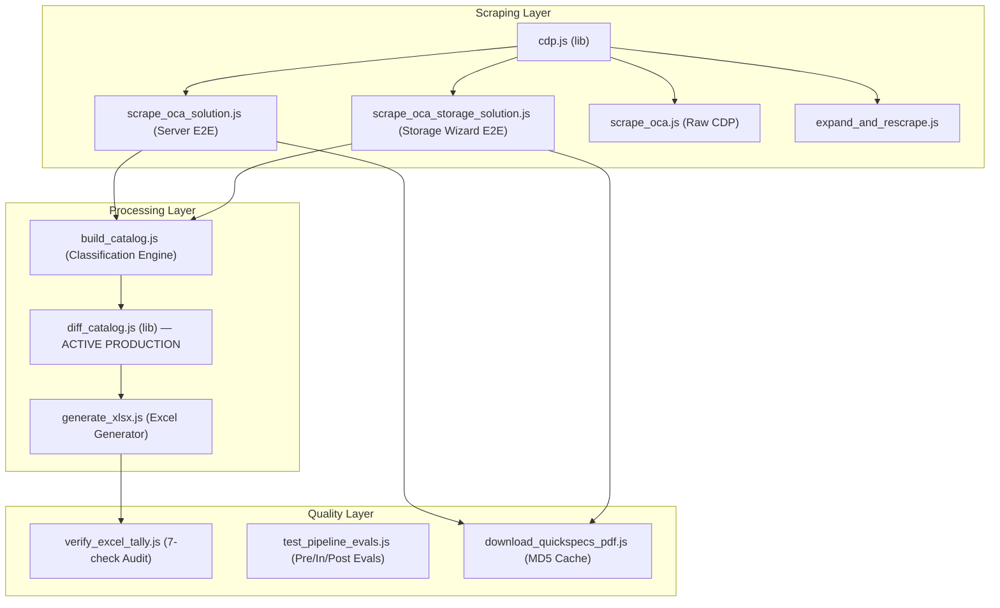

# Project Rules — HPE OCA Catalog Intelligence

## Project Overview
This workspace contains tools for scraping, parsing, and organising HPE server product catalog data from the **OCA (Online Configuration Application)** portal. The primary outputs are classified Excel workbooks + JSON companions for import into Google Notebook LM and the Vendor BOM Comparison Engine.

---

## Pipeline State of Health (Last Updated: 2026-08-07)

### ✅ Certified Products (100% Audit Pass)
| Product | Family | Output Prefix | SKUs | Excel Sheets | QuickSpecs PDF | Status |
|---------|--------|---------------|------|-------------|----------------|--------|
| HPE ProLiant DL380 Gen12 SFF | ProLiant | `DL380_Gen12_SFF` | 951 | 30 | ✅ Verified (2.06 MB) | ✅ 100% PASS |
| HPE Alletra Storage System | Alletra | `Alletra_Storage_System` | 92 | 8 | ✅ Verified (2.06 MB) | ✅ 100% PASS |
| HPE ProLiant DL380 Gen11 | ProLiant | `DL380_Gen11` | 1,253 | 24 | ✅ Verified (2.06 MB) | ✅ 100% PASS |
| HPE StoreEver MSL3040 Tape Library | StoreEver | `MSL3040_Tape` | 85 | 11 | ✅ Verified (2.06 MB) | ✅ 100% PASS |
| HPE Cray Supercomputing GX5000 Rack | Cray | `GX5000_General_RACK` | 46 | 11 | ⚠️ Advisory (No DOM link) | ✅ 100% PASS |
| HPE Synergy VC 100Gb F32 Module | Synergy | `SY100Gb_F32_Module` | 141 | 8 | ✅ Verified (0.89 MB) | ✅ 100% PASS |

**Total Portfolio Intelligence**: **2,568 unique SKUs** across 6 product lines in 5 families. 81/81 Test Assertions 100% Certified.

### ✅ Resolved & Certified Pipeline Health (100% Audit Pass)
| ID | Issue / Feature | Status | Resolution / Implemented Module |
|----|-----------------|--------|--------------------------------|
| **G25/G26/G32** | Dynamic Chassis Pathing & `--chassis` Flag | ✅ RESOLVED | `eval_boq.js` and `boq_evaluator.js` accept `--chassis <dir>` flag and auto-detect target chassis from BOQ items via `autoDetectChassisDetailed()`. |
| **G27a-e** | Machine-Parseable CLI `--json` Output | ✅ RESOLVED | `eval_boq.js`, `observability_status.js`, `verify_excel_tally.js`, `build_catalog.js`, `scrape_oca_solution.js`, and `scrape_oca_storage_solution.js` support stdout JSON mode for SSE stream ingestion. |
| **G28** | Dynamic Notebook ID Registry | ✅ RESOLVED | `scripts/config/notebooks.json` externalizes NotebookLM notebook IDs per chassis family. |
| **G29** | Reusable Catalog Discovery API | ✅ RESOLVED | `scripts/lib/catalog_discovery.js` provides programmatic catalog search, detail retrieval, and CDP port status. |
| **G30** | Absolute Telemetry Directory Path | ✅ RESOLVED | `telemetry.js` anchors `pipeline_telemetry.json` relative to `__dirname` (`PROJECT_ROOT/outputs/history/`). |
| **G31 / Q4** | Universal Dynamic Upgrade Engine | ✅ RESOLVED | `budget_optimizer.js` extracts upgrades per product line (ProLiant, Alletra, Synergy) with fallback to `scripts/config/upgrade_templates.json`. |
| **G33** | Mandatory `outputDir` Parameter | ✅ RESOLVED | `processPortalFeedback()` requires explicit output directory parameter (no hardcoded fallback). |
| **G36** | SSE Progress Event Emitter | ✅ RESOLVED | `scripts/lib/progress.js` provides `emitProgress()`, `emitLog()`, and `emitResult()` when `STRUCTURED_PROGRESS=1`. |
| **G37 / Q3** | User Feedback Queue & Agent Auto-Pickup | ✅ RESOLVED | `scripts/lib/feedback_queue.js` provides `appendFeedback()`, `getNextPendingFeedback()`, and `formatAgentTaskPrompt()`. |
| **Q2** | Low-Confidence Chassis Detection Prompting | ✅ RESOLVED | `autoDetectChassisDetailed()` computes confidence scores; if `score < 0.75`, `eval_boq.js` flags `requiresUserChassisConfirmation: true`. |
| **D3** | Workload DNA Dynamic Resolution Scores | ✅ RESOLVED | `conflict_graph.js` computes 5-tier solution scores dynamically from workload DNA alignment and fix penalties. |
| **D4** | Zero-Price SKU Safeguards | ✅ RESOLVED | `budget_optimizer.js` tracks `zeroPriceCount` and flags `hasZeroPriceSkus: true`. Fixed test assertions in `test_all_aspects.js`. |
| **S1-S5** | Closed-Loop Automated Knowledge Sync | ✅ RESOLVED | `knowledge_sync.js` and `npm run sync:knowledge` automatically structure learned rules into Scope Taxonomy (`UNIVERSAL_VENDOR`, `FAMILY_GEN`, `CHASSIS_SPECIFIC`) and update Gemini NotebookLM payloads. |

### 🚀 Production Features Active
- **Centralized HPE SKU Normalizer**: `scripts/lib/sku.js` provides single source of truth for hardware SKUs, option mode suffixes (`CTO`/`BTO`/`FIO`), and service SKUs.
- **Catalog Diff & Price Tracking Engine**: `scripts/lib/diff_catalog.js` saves date-stamped snapshots in `history/catalog_{YYYY-MM-DD}.json` and logs cumulative price trails in `price_history.json`.
- **Master Catalog Registry Auto-Synchronizer**: `scripts/lib/sync_registry.js` (`npm run registry:sync`) automatically scans and updates `outputs/SCRAPED_CATALOGS.md`.
- **WebLogic & Legacy UI Modal Interceptor**: Auto-accepts JS alert dialogs (`Page.handleJavaScriptDialog`) and session extension popups (`dismissDOMModals`).

---

## Canonical Directory Layout

```
booktoSkill/
├── .agents/
│   ├── AGENTS.md                          ← these rules (project-scoped)
│   └── skills/
│       ├── orchestrator-workflow-skill/   ← macro 6-stage lifecycle orchestration
│       ├── oca-catalog-scraper/           ← step-by-step scraping skill
│       ├── boq-eval-skill/                ← BOQ validation & pre-flight skill
│       └── nlm-skill/                     ← Gemini NotebookLM RAG integration
├── scripts/                               ← ALL Node.js scripts live here
│   ├── lib/
│   │   ├── cdp.js                         ← shared CDP connection & command module
│   │   ├── diff_catalog.js                ← catalog diff & price history engine
│   │   ├── dom_extract.js                 ← DOM text & table extraction helpers
│   │   ├── fs_compat.js                   ← cross-platform file move & cleanup helpers
│   │   ├── logger.js                      ← standardized console logger
│   │   ├── product_meta.js                ← universal product family & model parser
│   │   ├── registry.js                    ← shared registry table updater (DRY)
│   │   ├── sku.js                         ← centralized HPE SKU regex & normalization
│   │   └── sync_registry.js               ← master registry auto-synchronizer
│   ├── scrape_oca.js                      ← CDP raw data extractor
│   ├── expand_and_rescrape.js             ← expand DOM then re-scrape
│   ├── scrape_oca_solution.js             ← generic E2E server & solution scraper
│   ├── scrape_oca_storage_solution.js     ← dedicated storage solution wizard scraper (Alletra/Nimble/MSA)
│   ├── build_catalog.js                   ← parse raw JSON → catalog JSON + TSVs
│   ├── generate_xlsx.js                   ← TSVs → multi-sheet Excel workbook (xlsx-js-style)
│   ├── download_quickspecs_pdf.js         ← download + cache QuickSpecs PDF
│   ├── verify_excel_tally.js              ← post-flight audit (7 checks including historical diff)
│   ├── test_pipeline_evals.js             ← pre/in/post-flight eval suite (--post-flight-only mode)
│   ├── verify_all.js                      ← universal portfolio verification suite (npm test)
│   ├── rebuild_all.js                     ← rebuild all catalogs from raw_data (npm run rebuild)
│   ├── demo_qs_vs_menu_cdp.js             ← QuickSpecs vs Menu link demo
│   └── live_visual_demo_cdp.js            ← visual browser demo
├── outputs/                               ← ALL scrape outputs live here
│   ├── SCRAPED_CATALOGS.md                ← master registry of every scrape
│   └── {Family}/
│       └── {GenX}/
│           └── {Model}_{FormFactor}/      ← one folder per distinct chassis
│               ├── raw_data/
│               │   └── oca_raw_data_full.json
│               ├── intermittent_scraps/
│               │   ├── {prefix}_Catalog_SKUs.tsv
│               │   ├── {prefix}_Catalog_Rules.tsv
│               │   └── {prefix}_Catalog_Summary.tsv
│               ├── history/               ← date-stamped snapshots + price trail
│               │   ├── catalog_{YYYY-MM-DD}.json
│               │   └── price_history.json
│               ├── {prefix}_Catalog.json
│               ├── {prefix}_OCA_Catalog.xlsx
│               └── HPE_{prefix}_QuickSpecs.pdf
├── node_modules/                          ← npm dependencies (ws, xlsx, xlsx-js-style)
├── README.md                              ← project documentation & run commands
└── package.json                           ← npm configuration & script targets
```

> **Rule — NO FILES AT PROJECT ROOT**: Output JSON, Excel, TSV, and PDF files MUST NEVER be written to the project root. All outputs go inside `outputs/{Family}/{Gen}/{Model}/`.

---

## Authentication & Browser Rules

1. **NEVER navigate directly to OCA URLs** — The OCA portal requires authentication through the HPE Partner Portal (`https://partner.hpe.com`). Always let the user log in first via the Antigravity browser, then interact with the existing authenticated session.

2. **Use CDP (Chrome DevTools Protocol) on port 9222** — The Antigravity browser exposes remote debugging. Use WebSocket connections for all scraping operations via `scripts/lib/cdp.js` (bypasses browser subagent rate limits):
   ```bash
   # List all open page targets
   curl -s http://localhost:9222/json | python3 -c "import json,sys; [print(t['id'], t['url']) for t in json.load(sys.stdin) if t.get('type')=='page']"
   ```
   All Node.js scripts auto-detect the active `oca.ext.hpe.com` page target dynamically using `getOCATarget()`.

3. **Find the OCA page target by URL** — Filter for `oca.ext.hpe.com` in the CDP targets list to get the correct PAGE_ID.

---

## Scraping Rules

4. **Always expand before scraping** — Click "Expand All", "Expand Subsections", AND all `input[id*="showmore"]` checkboxes. Verify page `scrollHeight` increased from ~5,000px to ≥ 15,000px before extracting data.

5. **Chunk large text extractions** — `document.body.innerText` can exceed 60K chars. Extract in ≤ 50K-char chunks to avoid CDP payload limits.

6. **Skip the nav menu when mapping categories** — Main category names appear TWICE on the OCA page:
   - First in the left navigation menu (text positions < 1,010) — **SKIP THESE**
   - Second in the main content area (positions > 1,010) — **USE THESE**
   - Set `NAV_MENU_END = 1010` as the threshold.

7. **Use DOM table-index order for sub-table inheritance** — Sub-tables (those with a configuration rule but no `(max N)` subcategory header) inherit from the preceding matched subcategory using **table index order**, NOT text position (text position fails for template IDs like `dl380pat001b94fb`).

---

## Data Quality Rules

8. **Preserve ALL configuration rules** — Rules like "Mixing of x4 and x8 memory is not allowed" or "Supported with EDSFF CTO Server only" are critical intelligence. Always capture the first row of each table if it contains a rule.

9. **Capture quantity constraints precisely** — Every subcategory has exactly one constraint: `(max N)`, `(required)`, or `(no max)`. These are essential for BOM validation. In internal structures, `-1` represents `no max` (Unlimited), `-2` represents `required` (Required), and positive integers represent numeric caps.

10. **Current Qty must be a clean integer string** — `Current Qty` MUST pass `/^\d+$/` on 100% of SKU rows. OCA sometimes concatenates a row-index number with the part number in a single DOM cell (e.g. `"90\n\t\tS0W16AAE"`). Always extract the HPE part-number token with a regex like `/([A-Z0-9]{3}[A-Z0-9\-]{2,20}[A-Z0-9])/` and default `Current Qty` to `"0"` when the raw value is non-numeric.

11. **Track availability dates** — Both `Start` and `Discontinued` dates must always be preserved.

---

## Zero Hardcoding Rule

12. **Scripts must derive ALL paths dynamically** — Never hardcode absolute paths, product names, part numbers, or family identifiers inside scripts:
    - `build_catalog.js` accepts `<raw_input.json>` and `<catalog_output.json>` as explicit CLI arguments.
    - `generate_xlsx.js` accepts `<output_xlsx_path>` as explicit CLI argument.
    - `verify_excel_tally.js` accepts `<output_xlsx_path>` as explicit CLI argument.
    - `test_pipeline_evals.js` accepts `<output_xlsx_path>` as explicit CLI argument.
    - `download_quickspecs_pdf.js` accepts `<docId_or_url>` and `<dest_absolute_path>` as explicit CLI arguments.
    - File prefix (e.g. `DL380_Gen12_SFF`) is derived from the output filename — never hardcoded.
    - The **canonical run commands** for DL380 Gen12 SFF are:
      ```bash
      node scripts/build_catalog.js \
        outputs/ProLiant/Gen12/DL380_Gen12_SFF/raw_data/oca_raw_data_full.json \
        outputs/ProLiant/Gen12/DL380_Gen12_SFF/DL380_Gen12_SFF_Catalog.json

      node scripts/generate_xlsx.js \
        outputs/ProLiant/Gen12/DL380_Gen12_SFF/DL380_Gen12_SFF_OCA_Catalog.xlsx

      node scripts/verify_excel_tally.js \
        outputs/ProLiant/Gen12/DL380_Gen12_SFF/DL380_Gen12_SFF_OCA_Catalog.xlsx
      ```
    - For any other chassis, substitute the appropriate paths — the scripts require no code changes.

---

## Output Format

13. **Multi-sheet Excel workbook** — Always generate with these sheets (in this order):
    - `Category Summary` — Overview of all subcategories, constraints, SKU counts
    - `All SKUs` — Master catalog with all 17 fields (see SKU schema in SKILL.md) + 5 diff fields when history exists
    - `Rules & Constraints` — All configuration rules and mixing restrictions
    - `Catalog Diff & History` — Color-coded diff sheet (generated when previous snapshots exist)
    - Category-specific drill-down sheets: dynamically generated from SKU data (Required 7 first: Processor, Memory, Smart Chassis, Storage Devices, Networking, Power Supplies, Graphics Options — if present; then any extras)
    - `Metadata` — Chassis name, scrape date, total SKUs, total rules, total tables, output folder

14. **JSON companion file** — Always generate `{prefix}_Catalog.json` alongside the Excel. Schema:
    ```json
    {
      "metadata": { "chassis", "scrapeDate", "totalSubcategories", "totalUniqueSKUs", "totalTables" },
      "subcategories": [{ "parentCategory", "name", "constraint", "maxQty" }],
      "entries": [{ "parentCategory", "subCategory", "constraint", "maxQty", "rules", "headers", "skuCount", "skus" }]
    }
    ```

15. **SCRAPED_CATALOGS.md registry** — After every successful scrape, add or update a row in `outputs/SCRAPED_CATALOGS.md` with: date, chassis model, total SKUs, links to xlsx/json/pdf, and output path.

---

## Output Folder Naming Convention

```
outputs/{Family}/{Gen}/{Model}_{FormFactor}/
```

| Segment | Rule | Examples |
|---------|------|---------|
| `{Family}` | HPE product family | `ProLiant`, `Synergy`, `Alletra`, `Aruba`, `Cray` |
| `{Gen}` | Generation | `Gen12`, `Gen11`, `Gen10Plus`, `Storage`, `Networking` |
| `{Model}_{FormFactor}` | Model + form factor shorthand (no verbose OCA names, no SKU IDs) | `DL380_Gen12_SFF`, `DL360_Gen12_LFF`, `SY100Gb_F32_Module`, `Alletra_9000` |

> **Never** use verbose OCA-generated folder names (e.g. `HPE_ProLiant_Compute_DL380_Gen12_SFF_NC_..._P73282-B21`). Always use clean shorthand above.

---

## Dependencies

16. **Required npm packages**: `ws` (WebSocket for CDP), `xlsx` (Excel generation), `xlsx-js-style` (cell-level styling with colors and strikethroughs)
    ```bash
    npm install ws xlsx xlsx-js-style
    ```

---

## Solution-First 4-Level Root Traversal Protocol

17. For multi-node quotes, Synergy frames, or complex multi-server orders — **NEVER assume the active OCA page is the Solution Root**:
    - **Level 1 (Solution Root)**: Always click the `↑` (`#nav_up` / `.icon-arrow-up3`) arrow next to breadcrumbs OR use `#selectNavTreeOption` to reach the top. Go to the `Components` tab (`#extended_overview_components`) to discover ALL Icons and Product Nodes.
    - **Level 2 (Icon / Group)**: Enumerate all Icons in the solution.
    - **Level 3 (Product Node)**: Enumerate all Product Nodes under each Icon.
    - **Level 4 (Menu Categories & Leaf SKUs)**: For EACH Product Node: switch to that node, navigate to its `Menu` tab, expand all sections, and scrape its catalog. Tag every row with its full 4-level path: `Solution > Icon > Product Node > Main Category > Sub-Category`.

---

## Agent Evals & Quality Guardrails

18. **Pre-Flight Assertion**: Before scraping, verify `#selectNavTreeOption` or `#nav_up` has been evaluated to confirm you are at (or can reach) Solution Root. Abort if starting mid-tree.

19. **In-Flight Expansion Assertion**: After clicking "Expand All", "Expand Subsections", and all `input[id*="showmore"]`, assert `document.body.scrollHeight > 15000`. Retry expansion if height is below threshold.

20. **Post-Flight Data Quality Assertions** (run via `node scripts/verify_excel_tally.js <output_xlsx_path>` or `npm test`):
    - `Current Qty` MUST pass `/^\d+$/` on **100%** of SKUs (zero text pollution)
    - `Hierarchy Path` MUST contain ≥ 3 `>` delimiters on 100% of SKUs
    - Excel `All SKUs` row count MUST equal JSON `totalUniqueSKUs`
    - Total SKU count MUST be > 0
    - All required Excel sheets MUST be present
    - QuickSpecs PDF MUST be > 500 KB (when present; advisory when absent)

21. **DOM Filter Immunity**: UI filters (`View HPE Recommended Only`, `Smart Defaults`, `display: none` rows) must never block catalog extraction. Extract ALL `table` and `tr` elements directly from DOM — including hidden rows.

---

## QuickSpecs PDF Rules

22. **QuickSpecs PDF Link vs Component Menu Link** — Two distinct elements exist next to part numbers in the Components table:
    - **`a.qs-link-a` / `i.icon-chain2.qs-link-icon` (chain link 🔗)**: Opens the QuickSpecs PDF. **DO NOT CLICK FOR CATALOG NAVIGATION**.
    - **`.menu_label` / `a[href*="extended_overview_menu"]`**: Opens the component's Menu tab. **CLICK HERE FOR CATALOG SCRAPING**.

23. **QuickSpecs PDF Download & MD5 Fingerprint Cache**:
    - Run: `node scripts/download_quickspecs_pdf.js <docId_or_url> <dest_absolute_path> [--force]`
    - **Cache check first**: Before downloading, compute MD5 hash of any existing file. If hash matches and file > 500 KB, return `⚡ [CACHE HIT]` — skip download entirely.
    - Uses `Target.createTarget` + `Page.setDownloadBehavior` — never disturbs the active OCA quote session.
    - After download, assert file size > 500 KB. Clean up any temporary auto-downloaded duplicates.
    - Output PDF naming convention: `HPE_{prefix}_QuickSpecs.pdf` inside the product folder.

---

## Multi-Product Family & Complex Solution Rules

24. **Multi-Product Architecture Immunity**:
    - Never assume Menu categories or component roles are static or identical across ProLiant, Synergy, Alletra, StoreOnce, Aruba, or Cray product lines.
    - `build_catalog.js` dynamically extracts all main categories and subcategory constraints from DOM section headers (`\n [Header]\n`), `sections` payload, and constraint headers (`(max N)`, `(required)`, `(no max)`).
    - Component role assignment (`getComponentRole`) supports ProLiant, Synergy (Frame Link, Composer, Compute Module, Fabric Module), Alletra/Nimble/StoreOnce (Controllers, Enclosures, Media Packs), Aruba (Switch Chassis, Line Cards, Transceivers), and Cray (EX Cabinets, Liquid Cooling, Slingshot).
    - Every extracted SKU row carries a full 4-level context path `HPE OCA > {Chassis} [{BaseSKU}] > {Main Category} > {Sub-Category}` so compute nodes, frame link modules, storage shelves, and interconnect fabrics inside complex multi-node quotes never mix or cross-pollute schema definitions.

---

## Extending the Pipeline to New Chassis

25. To scrape a **new chassis** (e.g. Synergy SY480 Gen11 or Alletra 9000):
    1. User navigates to the new chassis in OCA (authenticated session)
    2. Run `node scripts/scrape_oca_solution.js` — it auto-detects product family/gen/model from the DOM
    3. Output automatically goes to `outputs/{Family}/{Gen}/{Model}_{FormFactor}/`
    4. Run `npm run registry:sync` to index the new catalog
    5. **No code changes required** — scripts are fully generic

26. When the **OCA portal UI changes**, check:
    - Table structure (header row position, column names)
    - Subcategory constraint format `(max N)`, `(required)`, `(no max)`
    - "Show more" checkbox ID pattern (`input[id*="showmore"]`)
    - Nav menu end threshold (`NAV_MENU_END = 1010`)

27. **Storage Solution Wizard Scraper (`scrape_oca_storage_solution.js`)**:
    - For storage systems (Alletra 5000/6000/9000, Nimble, StoreOnce, MSA, SimpliVity), configuration options use step-by-step UI wizards (`#tabs_alletra_5000_wizard` or `[class*="wizard_tabs"]`) rather than standard single-page `Menu` tables.
    - Run `node scripts/scrape_oca_storage_solution.js [output_json_path]` to iterate through all wizard sub-tabs (`Array Selection`, `Base Array Components`, `Add-on Storage`, `MISC Hardware`), extract `<select>` option dropdowns & `<table>` elements, build JSON + multi-sheet Excel, download/verify QuickSpecs PDF, and run post-flight tally verification automatically.

---

## Catalog Diff & Price Tracking (Rule #28 — ACTIVE PRODUCTION)

28. **Historical Snapshot Versioning & Color-Coded Price Diffs**:
    - **Snapshot storage**: `outputs/{Family}/{Gen}/{Model}/history/catalog_{YYYY-MM-DD}.json` — one per scrape date
    - **Price history log**: `outputs/{Family}/{Gen}/{Model}/history/price_history.json` — cumulative trail per SKU
    - **Diff status taxonomy**: Every SKU tagged as `ADDED`, `REMOVED`, `PRICE_CHANGED`, or `UNCHANGED`
    - **Color conventions**: Green font (`#137333`) = Added, Red font + strikethrough (`#C5221F`) = Removed, Amber font (`#B06000`) = Price Changed
    - **Mandate**: REMOVED SKUs must NEVER be silently dropped — they persist in the Excel as tombstone rows with visual indicators
    - **Price delta fields**: `Previous List Price (USD)`, `Price Change (USD)`, `Price Change (%)`, `Price History Trail`
    - **Downstream BOM impact**: When the BOM Comparison Engine imports catalogs, diff metadata enables intelligent procurement decision-making ("this SKU was recently discontinued" / "price increased 15% since last month")

---

## Automated Dialog & Session Timeout Protocol (Rule #29)

29. **Legacy WebLogic & UI Modal Handling**:
    - **JS Alert/Confirm Dialog Interception**: CDP scripts enable `Page.enable` and listen for `Page.javascriptDialogOpening`. Any modal popups (`alert`, `confirm`, `prompt`) are automatically accepted via `Page.handleJavaScriptDialog({ accept: true })` to prevent blocked execution.
    - **DOM Modal & Session Timeout Prompts**: Scrapers execute `dismissDOMModals()` before expanding sections to automatically click session extension buttons (`"Continue session"`, `"Stay logged in"`) and modal confirmation buttons (`"Proceed"`, `"Continue"`, `"OK"`, `"Confirm"`).
    - **Safety Guardrail**: Action buttons containing `"Cancel"`, `"Delete"`, or `"Remove"` are strictly ignored to prevent destructive transaction mutations.



### Data Flow Per Script

| Script | Inputs | Outputs | Key Algorithm |
|--------|--------|---------|---------------|
| `scrape_oca_solution.js` | Live CDP session | `raw_data/oca_raw_data_full.json` | 4-level traversal, chunked text, row-array tables |
| `scrape_oca_storage_solution.js` | Live CDP session | `raw_data/oca_raw_data_full.json` | Wizard sub-tab iteration, `<select>` → synthetic tables |
| `build_catalog.js` | `oca_raw_data_full.json` | `*_Catalog.json` + 3 TSVs | Subcategory regex, NAV_MENU_END=1010, table-index inheritance |
| `generate_xlsx.js` | 3 TSVs + `*_Catalog.json` | `*_OCA_Catalog.xlsx` | Dynamic category sheets, 17-col schema, column widths |
| `verify_excel_tally.js` | `*_OCA_Catalog.xlsx` + `*_Catalog.json` | PASS/FAIL | 7 audit checks, MD5 fingerprint |
| `download_quickspecs_pdf.js` | docId + dest path | QuickSpecs PDF | MD5 cache, dedicated Chrome tab, file-diff detection |

---

## CTO vs Base SKU Normalization Protocol (Rule #30)

30. **CTO / BTO / FIO Suffix Extraction**:
    - `build_catalog.js` automatically strips `CTO` (Configure-To-Order), `BTO` (Build-To-Order), and `FIO` (Factory Integrated Option) suffixes from part numbers to yield clean base SKUs (e.g. `S2S05ACTO` → `S2S05A`, `P73282-B21CTO` → `P73282-B21`).
    - An explicit schema column `Option Type` is populated with `CTO`, `BTO`, `FIO`, or `Standard`.
    - Base SKUs allow direct cross-catalog lookup and price history tracking across build modes.

31. **Standalone Base Chassis List Pricing vs Solution Totals**:
    - Never confuse total pre-configured solution/quote bundle totals ($60K–$180K containing dual CPUs, RAM, GPUs, NVMe) with standalone Base Chassis CTO list prices ($4,500–$7,500).
    - Capture standalone Base Chassis list prices from the search/autocomplete dropdown or base chassis table rows.

32. **Price-Prioritized CTO vs Smart CTO Selection Protocol**:
    - When duplicate `CTO` and `Smart CTO` rows exist for the same chassis SKU in the autocomplete list, `build_catalog.js` uses `hasValidPrice` to automatically retain the `CTO` row with a valid non-zero list price (e.g. `$5,070.00`) and discard the unpriced `-` `Smart CTO` row.

33. **MEA / Dubai Regional Exclusion Protocol**:
    - All `TAA`, `TAA Compliant`, `GTA`, and `#GTA` chassis variants and SKUs are automatically filtered out from primary catalog exports per MEA (Dubai) regional procurement requirements.

34. **Services Full-Depth Scraping Protocol**:
    - OCA Services live on dedicated tabs (`#extended_overview_suisvc` for Support Services and `#other-services` for Deployment & Professional Services).
    - Scrapers must iterate through all detail sections and pagination pages to capture 100% of Base Support tiers (Tech Care Essential/Basic, Complete Care, 3Y/4Y/5Y terms), Deployment, and Professional Services.

35. **Strict HPE Part Number Regex Validation (`scripts/lib/sku.js`)**:
    - Hardware SKUs MUST pass `isValidHpeSKU()` matching hyphenated hardware SKUs (e.g. `P73282-B21`, `P69729-F21`, `804394-B21`) or standard 6-character hardware SKUs (e.g. `C0H28A`, `Q2R32A`, `BC002A`, `N9X06A`, `TC480A`).
    - Service SKUs MUST match `/^[HURS][A-Z0-9]{4,10}$/i` (e.g. `H7J32A`, `HV1H3E`, `H06CDE`, `HU4A6A50C4V`).
    - Internal DOM pattern IDs (`dl380pat001b94fb`) and arbitrary numeric strings (`0030031`) are strictly rejected.

---

## End-to-End Orchestrator Workflow (Rule #36)

36. **The 6-Stage Continuous Learning Loop**: Any complex request managed in this workspace maps to one of these 6 lifecycle stages. Use the correct tool for each stage:
    1. **Ingestion**: Live scraping using `oca-catalog-scraper`.
    2. **Knowledge Sync & Delta Tracking**: Update historical JSON/Excel deltas (`diff_catalog.js`) and sync `_OCA_Catalog.xlsx` files to Google Drive for NotebookLM using `nlm-skill`.
    3. **BOQ Upload & Pre-Flight**: Run physical/math evaluations using `boq-eval-skill`. **Loose Ambiguity Rule**: If the user's workload intent is ambiguous, DO NOT block; make educated assumptions, output Ranked Solutions, and explicitly state assumptions for the user.
    4. **Notebook Validations (RAG)**: Query Gemini NotebookLM (`nlm-skill`) to cross-reference constraints and solve gaps using synced documentation.
    5. **HITL Portal Trial**: Output 5-Tier Strategic Resolution Reports. The user attempts to build the top-ranked solution manually in the OCA vendor portal.
    6. **Feedback & Automation Learning**: If the portal rejects the configuration, run `npm run eval:boq <file> --simulate-portal-error "<error>"` to log a permanent `KnowledgeDelta`, ensuring the system inherently learns the new rule for future quotes.

---

## Universal Pre-Computed & Runtime Physical Math Engine (Rule #37)

37. **Dual-Layer Physical & Mathematical Constraint Engine**:
    - **Layer 1: Pre-computed Catalog Constraint Matrices** (`build_catalog.js` & `*_Catalog.json`): During catalog extraction, quantity constraints `(max N)`, `(required)`, `(no max)` and table rules are compiled into structured matrices (e.g. Memory Channels per CPU socket, PCIe slot budgets per Riser card, Storage Controller Cable Kit dependencies). These matrices are ingested into NotebookLM (`nlm-skill`) so RAG queries can answer constraint math questions instantly.
    - **Layer 2: Runtime Physical Math Evaluator** (`scripts/lib/boq_evaluator.js`): During BOQ evaluation, the system executes real-time mathematical validation across 6 physical aspects:
      1. **Compute & Thermal Math**: $\text{Max CPU TDP Watts} \ge 240\text{W} \implies \text{High-Performance Fan Kit mandatory}$.
      2. **Memory & Channel Math**: $\text{Total DIMMs} \pmod 8 == 0$ (Balanced channel population across sockets).
      3. **PCIe Slot Capacity & Riser Math**: $\text{Required PCIe Cards} > \text{Available Slots} \implies \text{Riser Expansion Kit mandatory}$; $\text{Secondary/Tertiary Riser} \implies 2\text{nd CPU Socket mandatory}$.
      4. **Storage Interconnect Math**: $\text{Tri-Mode Controller} + \text{Front Drive Box 1/2} \implies \text{Dedicated Cable Kit (e.g. P76453-B21) mandatory}$.
      5. **Power & Environmental Math**: $\text{-48VDC Power Supply} \implies \text{DC Lug Kit mandatory}$.
      6. **Support & Service Math**: $\text{Hardware SKUs} \implies \text{Mandatory Tech Care Support Tier}$.
    - **Component Role Taxonomy Genericity**: The physical math functions use generic component roles (`Compute`, `Memory`, `Storage`, `Interconnect`, `Power`, `Support`) which are designed to be extensible across vendor platforms (Dell PowerEdge, Cisco UCS, Lenovo ThinkSystem, etc.). **Note**: The current portal scrapers, CDP selectors, URL matching (`oca.ext.hpe.com`), and SKU regexes are HPE OCA-specific. Extending to other vendors would require implementing new scraper modules — the physical math evaluation layer and component role taxonomy do not need changes.

---

## Category Math & Chassis Defaults Conflict Resolution Engine (Rule #38)

38. **Dynamic Chassis Defaults & Category Math Integration**:
    - **Base Chassis Default Ingestion**: Every base chassis configuration comes with factory baseline defaults (default AC power supplies, standard cooling fans, default 0-drive configuration, base PCIe slots).
    - **Category Math Aggregation**: The final configuration is computed as:
      $$\text{Solution BOM} = \text{Base Chassis Defaults} + \sum (\text{Category Selected Options}) + \sum (\text{Derived Dependencies}) - \text{Overridden Defaults}$$
    - **Conflict Resolution & Clear Reasoning Chain**: When category options conflict with chassis defaults (e.g. High TDP CPU > 240W overrides standard fans with High-Performance Fan Kit; -48VDC power supply overrides AC power supplies), the evaluator:
      1. Detects the conflict without crashing.
      2. Outputs explicit reasoning: *"High TDP Processor (250W >= 240W) configured without High-Performance Fan Kit. Default Standard Fans replaced with High-Performance Fan Kit P48820-B21."*
      3. Dynamically injects mandatory missing dependencies into the BOM.
    - **Zero Hardcoding & Autonomous Learning**: All subcategory constraints `(max N)`, `(required)`, `(no max)` are parsed dynamically from the scraped catalog JSON and Excel summary sheet. Vendor portal rejections logged via `npm run eval:boq --simulate-portal-error` update the conflict resolution rules dynamically via `catalog_deltas.json` without modifying source code.

---

## Workload DNA Profiling & Multi-Metric 5-Tier Solution Ranking Engine (Rule #39)

39. **Workload DNA Alignment & Multi-Path Tradeoff Resolution Engine**:
    - **Customer Workload DNA Extraction**: Analysis of BOQ hardware items extracts workload characteristics:
      - **CPU Core/Frequency Profile**: High Core Density (>= 48 cores) vs High Frequency HPC (>= 3.4GHz) vs Balanced.
      - **Memory Density Ratio**: GB/Core ratio (e.g. >= 16 GB/core indicates In-Memory Database such as SAP HANA / Oracle).
      - **GPU / Accelerator Profile**: VDI & AI Graphics Acceleration (NVIDIA GPUs / L4 / L40S / H200).
      - **Storage I/O Profile**: Read Intensive (RI) vs Mixed Use (MU) vs Write Intensive (WI) NVMe/SAS SSDs.
    - **Multi-Path Alternate Solution Branching**: When conflicting SKUs or layout blocks occur (e.g., Double-width GPU vs Tertiary Riser slot cap, or x4 vs x8 memory mixing), the system branches into alternate buildable candidate paths rather than returning a single rigid error.
    - **Workload Intent-Preserved Ranking (Rank 1)**: Technical maxing-out is NOT automatically Rank 1. Rank 1 is strictly assigned to the solution that **best preserves the customer's true workload intent** without over- or under-provisioning.
    - **5-Tier Strategic Resolution Matrix & Tradeoff Rationale**: Every BOQ evaluation outputs 5 ranked buildable candidate tiers:
      - **Rank 1**: Customer Workload Intent Preserved (Optimal Match, zero over/under-provisioning).
      - **Rank 2**: Standardized CTO Baseline & Maximum Factory Stability.
      - **Rank 3**: High-IOPS & Storage Performance Optimized.
      - **Rank 4**: Maximum Density & Future Scalability Expansion (Full PCIe/Riser & 1DPC Memory headroom).
      - **Rank 5**: Budget & CapEx Minimized Buildable Tier.
    - Every rank includes multi-metric tradeoff indicators (`Intent Alignment %`, `SKU Modifications Count`, `Cost Delta $`, `Capacity Expansion Headroom`) and explicit technical rationale for pre-flight alignment with customer sales teams.

---

## Pointnext Support SKU Construction & Dynamic Price Scaling Taxonomy (Rule #40)

40. **HPE Pointnext Hardware Support SKU Construction & Price Scaling**:
    - **Modular SKU Construction**: HPE Pointnext hardware support SKUs use a 2-part modular structure:
      $$\text{Product \# (SKU)} = \text{Parent Service Family Code} + \text{Chassis Product Suffix Code}$$
      - **Parent Service Family Code**: `HU4A6A5` (5Y Tech Care Essential), `H7J34A3` (3Y Tech Care Basic), `HS7Y7E` (5Y Tech Care Basic), `H67B8E` (4Y Tech Care Critical), `H30ZCE` (3Y Complete Care).
      - **Chassis Product Suffix Code**: `00DJ` (DL360 Gen11 1U), `00DK` (DL380 Gen11 2U), `0C4U` (DL360 Gen12 1U), `0C4V` (DL380 Gen12 2U).
    - **Dynamic Hardware Support Price Math**: Pointnext support list prices scale dynamically based on total node hardware list price and populated component TDP/capacity:
      $$\text{Support List Price} = \text{Base Chassis Tier} + (\text{CPU TDP Factor} \times N_{\text{CPU}}) + (\text{RAM GB Factor} \times \text{RAM}_{\text{GB}}) + \text{Storage Factor}$$
    - **Multi-Tab Extraction Mandate**: Scrapers MUST extract `Menu` (options catalog), `Services` (Pointnext Tech Care options), AND `BOM` (calculated itemized support lines `HU4A6A50C4V`, `H39VPA1 5A6`) tabs to guarantee 100% complete intelligence.

---

## System Hardening & Agentic Guardrails (Rules #41–44)

41. **Backend Security & Command Injection Prevention**:
    - NEVER use `exec()` in Node.js backends or bridge servers (`server.cjs`) when handling any user input (like `chassisDir` or `query`).
    - ALWAYS use `execFile()` or `spawn()` with parameterized arrays to prevent shell injection and RCE exploits.

42. **Resource Management & Zombie Process Prevention**:
    - Browser subagents (Playwright/Puppeteer) and concurrent dev servers (`vite`) can cause severe memory leaks if orphaned.
    - Scripts must properly handle `SIGTERM` / `SIGINT` signals to cleanly terminate all child processes. 
    - Never use detached background tasks without strict timeout and cleanup routines.

43. **Frontend Data Mapping Resilience**:
    - UI components (`CatalogExplorer.jsx`, `nlpSearch.js`) must implement robust fallback parsing for OCA raw data schemas.
    - Raw scraped keys often contain spaces or symbols (e.g., `sku['List Price']`, `sku['Product #']`). Frontends must map both normalized and raw keys (e.g., `sku.listPrice || sku['List Price (USD)'] || sku['List Price']`) to prevent missing data in views.

44. **Agentic Browser Sandboxing**:
    - Autonomous browser subagents must be strictly sandboxed to the target `localhost` environments when executing UI tests.
    - Subagents are prohibited from autonomously navigating to authenticated portals (e.g., `partner.hpe.com`) during local UI testing, and must not attempt to exploit vulnerabilities to hot-patch live environments.
