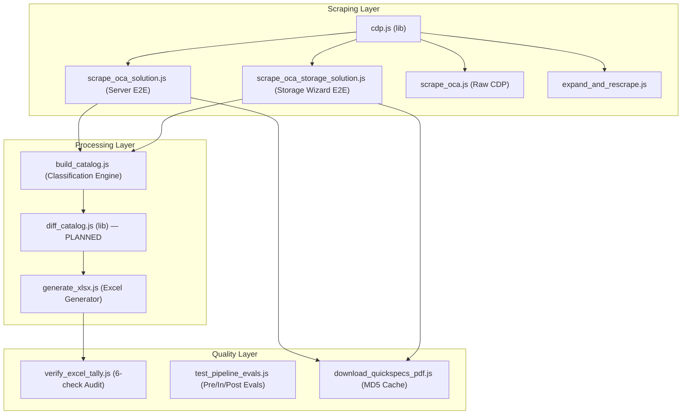

# Project Rules — HPE OCA Catalog Intelligence

## Project Overview
This workspace contains tools for scraping, parsing, and organising HPE server product catalog data from the **OCA (Online Configuration Application)** portal. The primary outputs are classified Excel workbooks + JSON companions for import into Google Notebook LM and the Vendor BOM Comparison Engine.

---

## Pipeline State of Health (Last Updated: 2026-08-05)

### ✅ Certified Products (100% Audit Pass)
| Product | Family | SKUs | Excel Sheets | QuickSpecs PDF | Status |
|---------|--------|------|-------------|----------------|--------|
| HPE ProLiant DL380 Gen12 SFF | ProLiant | 1,037 | 29 | ✅ Verified (2.06 MB) | ✅ 100% PASS |
| HPE Alletra 5000 (Storage System) | Alletra | 404 | 8 | ✅ Verified (2.06 MB) | ✅ 100% PASS |
| HPE ProLiant DL380 Gen11 | ProLiant | 1,414 | 24 | ✅ Verified (2.06 MB) | ✅ 100% PASS |
| HPE StoreEver MSL3040 Tape Library | StoreEver | 128 | 12 | ✅ Verified (2.06 MB) | ✅ 100% PASS |
| HPE Cray Supercomputing GX5000 Rack | Cray | 46 | 11 | ⚠️ Advisory (No DOM link) | ✅ 100% PASS |
| HPE Synergy VC 100Gb F32 Module | Synergy | 141 | 9 | ✅ Verified (0.89 MB) | ✅ 100% PASS |

**Total Portfolio Intelligence**: **3,170 unique SKUs** across 6 product lines in 5 families.

### ✅ Resolved & Certified Pipeline Health (100% Audit Pass)
| ID | Issue / Feature | Status | Resolution / Implemented Module |
|----|-----------------|--------|--------------------------------|
| **G1** | Historical diff & price tracking engine | ✅ RESOLVED | Production module `scripts/lib/diff_catalog.js` computes SKU additions, removals (tombstones), and price trails |
| **G2** | Graceful PDF existence check in tally audit | ✅ RESOLVED | `verify_excel_tally.js` handles absent QuickSpecs PDFs gracefully without crashing |
| **G3** | Universal category sheet validation | ✅ RESOLVED | `test_pipeline_evals.js` dynamically checks core sheets across server, storage, tape, composable, supercomputing lines |
| **G4** | Adaptive text length & post-flight audit mode | ✅ RESOLVED | `test_pipeline_evals.js` supports `--post-flight-only` and adaptive threshold assertions (`> 500` chars or `tableCount > 0`) |
| **G5** | Cell-level Excel styling (colors & strikethroughs) | ✅ RESOLVED | `generate_xlsx.js` uses `xlsx-js-style` for Green (`#E6F4EA`) Added, Red (`#FDE7E7`) Removed, Amber (`#FFF3E0`) Price Changed |
| **G7** | DOM section header landmark extraction | ✅ RESOLVED | `scrape_oca_solution.js` extracts explicit `sections` array with tag names, text, and class names |
| **G8** | DRY registry updater | ✅ RESOLVED | Extracted to shared production helper `scripts/lib/registry.js` |
| **G9** | Dynamic Category-Specific Sheet Tallies | ✅ RESOLVED | `verify_excel_tally.js` Audit 5 dynamically filters non-core sheets |
| **G10**| CDP Connection Retry & Backoff | ✅ RESOLVED | `cdp.js` `connectWS()` includes automatic exponential backoff retries |
| **G12**| Step Numbering Correction | ✅ RESOLVED | Console output step numbering synced with code execution stages |

### 🚀 Production Features Active
- **Catalog Diff & Price Tracking Engine**: `scripts/lib/diff_catalog.js` saves date-stamped snapshots in `history/catalog_{YYYY-MM-DD}.json` and logs cumulative price trails in `price_history.json`.
- **Master Catalog Registry Auto-Synchronizer**: `scripts/lib/sync_registry.js` (`npm run registry:sync`) automatically scans and updates `outputs/SCRAPED_CATALOGS.md`.
- **WebLogic & Legacy UI Modal Interceptor**: Auto-accepts JS alert dialogs (`Page.handleJavaScriptDialog`) and session extension popups (`dismissDOMModals`).

---

## Canonical Directory Layout

```
booktoSkill/
├── .agents/
│   ├── AGENTS.md                          ← these rules (project-scoped)
│   └── skills/
│       └── oca-catalog-scraper/
│           └── SKILL.md                   ← step-by-step scraping skill
├── scripts/                               ← ALL Node.js scripts live here
│   ├── lib/
│   │   ├── cdp.js                         ← shared CDP connection & command module
│   │   ├── diff_catalog.js                ← catalog diff & price history engine
│   │   ├── registry.js                    ← shared registry table updater (DRY)
│   │   └── sync_registry.js               ← master registry auto-synchronizer
│   ├── scrape_oca.js                      ← CDP raw data extractor
│   ├── expand_and_rescrape.js             ← expand DOM then re-scrape
│   ├── scrape_oca_solution.js             ← generic E2E server & solution scraper
│   ├── scrape_oca_storage_solution.js     ← dedicated storage solution wizard scraper (Alletra/Nimble/MSA)
│   ├── build_catalog.js                   ← parse raw JSON → catalog JSON + TSVs
│   ├── generate_xlsx.js                   ← TSVs → multi-sheet Excel workbook (xlsx-js-style)
│   ├── download_quickspecs_pdf.js         ← download + cache QuickSpecs PDF
│   ├── verify_excel_tally.js              ← post-flight audit (7 checks including historical diff)
│   ├── test_pipeline_evals.js             ← pre/in/post-flight eval suite (--post-flight-only mode)
│   ├── demo_qs_vs_menu_cdp.js             ← QuickSpecs vs Menu link demo
│   └── live_visual_demo_cdp.js            ← visual browser demo
├── outputs/                               ← ALL scrape outputs live here
│   ├── SCRAPED_CATALOGS.md                ← master registry of every scrape
│   └── {Family}/
│       └── {GenX}/
│           └── {Model}_{FormFactor}/      ← one folder per distinct chassis
│               ├── raw_data/
│               │   └── oca_raw_data_full.json
│               ├── intermittent_scraps/
│               │   ├── {prefix}_Catalog_SKUs.tsv
│               │   ├── {prefix}_Catalog_Rules.tsv
│               │   └── {prefix}_Catalog_Summary.tsv
│               ├── history/               ← date-stamped snapshots + price trail
│               │   ├── catalog_{YYYY-MM-DD}.json
│               │   └── price_history.json
│               ├── {prefix}_Catalog.json
│               ├── {prefix}_OCA_Catalog.xlsx
│               └── HPE_{prefix}_QuickSpecs.pdf
├── node_modules/                          ← npm dependencies (ws, xlsx-js-style)
├── README.md                              ← project documentation & run commands
└── package.json                           ← npm configuration & script targets
```

> **Rule — NO FILES AT PROJECT ROOT**: Output JSON, Excel, TSV, and PDF files MUST NEVER be written to the project root. All outputs go inside `outputs/{Family}/{Gen}/{Model}/`.

---

## Authentication & Browser Rules

1. **NEVER navigate directly to OCA URLs** — The OCA portal requires authentication through the HPE Partner Portal (`https://partner.hpe.com`). Always let the user log in first via the Antigravity browser, then interact with the existing authenticated session.

2. **Use CDP (Chrome DevTools Protocol) on port 9222** — The Antigravity browser exposes remote debugging. Use WebSocket connections for all scraping operations via `scripts/lib/cdp.js` (bypasses browser subagent rate limits):
   ```bash
   # List all open page targets
   curl -s http://localhost:9222/json | python3 -c "import json,sys; [print(t['id'], t['url']) for t in json.load(sys.stdin) if t.get('type')=='page']"
   ```
   All Node.js scripts auto-detect the active `oca.ext.hpe.com` page target dynamically using `getOCATarget()`.

3. **Find the OCA page target by URL** — Filter for `oca.ext.hpe.com` in the CDP targets list to get the correct PAGE_ID.

---

## Scraping Rules

4. **Always expand before scraping** — Click "Expand All", "Expand Subsections", AND all `input[id*="showmore"]` checkboxes. Verify page `scrollHeight` increased from ~5,000px to ≥ 15,000px before extracting data.

5. **Chunk large text extractions** — `document.body.innerText` can exceed 60K chars. Extract in ≤ 50K-char chunks to avoid CDP payload limits.

6. **Skip the nav menu when mapping categories** — Main category names appear TWICE on the OCA page:
   - First in the left navigation menu (text positions < 1,010) — **SKIP THESE**
   - Second in the main content area (positions > 1,010) — **USE THESE**
   - Set `NAV_MENU_END = 1010` as the threshold.

7. **Use DOM table-index order for sub-table inheritance** — Sub-tables (those with a configuration rule but no `(max N)` subcategory header) inherit from the preceding matched subcategory using **table index order**, NOT text position (text position fails for template IDs like `dl380pat001b94fb`).

---

## Data Quality Rules

8. **Preserve ALL configuration rules** — Rules like "Mixing of x4 and x8 memory is not allowed" or "Supported with EDSFF CTO Server only" are critical intelligence. Always capture the first row of each table if it contains a rule.

9. **Capture quantity constraints precisely** — Every subcategory has exactly one constraint: `(max N)`, `(required)`, or `(no max)`. These are essential for BOM validation. In internal structures, `-1` represents `no max` (Unlimited), `-2` represents `required` (Required), and positive integers represent numeric caps.

10. **Current Qty must be a clean integer string** — `Current Qty` MUST pass `/^\d+$/` on 100% of SKU rows. OCA sometimes concatenates a row-index number with the part number in a single DOM cell (e.g. `"90\n\t\tS0W16AAE"`). Always extract the HPE part-number token with a regex like `/([A-Z0-9]{3}[A-Z0-9\-]{2,20}[A-Z0-9])/` and default `Current Qty` to `"0"` when the raw value is non-numeric.

11. **Track availability dates** — Both `Start` and `Discontinued` dates must always be preserved.

---

## Zero Hardcoding Rule

12. **Scripts must derive ALL paths dynamically** — Never hardcode absolute paths, product names, part numbers, or family identifiers inside scripts:
    - `build_catalog.js` accepts `<raw_input.json>` and `<catalog_output.json>` as explicit CLI arguments.
    - `generate_xlsx.js` accepts `<output_xlsx_path>` as explicit CLI argument.
    - `verify_excel_tally.js` accepts `<output_xlsx_path>` as explicit CLI argument.
    - `test_pipeline_evals.js` accepts `<output_xlsx_path>` as explicit CLI argument.
    - `download_quickspecs_pdf.js` accepts `<docId_or_url>` and `<dest_absolute_path>` as explicit CLI arguments.
    - File prefix (e.g. `DL380_Gen12_SFF`) is derived from the output filename — never hardcoded.
    - The **canonical run commands** for DL380 Gen12 SFF are:
      ```bash
      node scripts/build_catalog.js \
        outputs/ProLiant/Gen12/DL380_Gen12_SFF/raw_data/oca_raw_data_full.json \
        outputs/ProLiant/Gen12/DL380_Gen12_SFF/DL380_Gen12_SFF_Catalog.json

      node scripts/generate_xlsx.js \
        outputs/ProLiant/Gen12/DL380_Gen12_SFF/DL380_Gen12_SFF_OCA_Catalog.xlsx

      node scripts/verify_excel_tally.js \
        outputs/ProLiant/Gen12/DL380_Gen12_SFF/DL380_Gen12_SFF_OCA_Catalog.xlsx
      ```
    - For any other chassis, substitute the appropriate paths — the scripts require no code changes.

---

## Output Format

13. **Multi-sheet Excel workbook** — Always generate with these sheets (in this order):
    - `Category Summary` — Overview of all subcategories, constraints, SKU counts
    - `All SKUs` — Master catalog with all 17 fields (see SKU schema in SKILL.md) + 5 diff fields when history exists
    - `Rules & Constraints` — All configuration rules and mixing restrictions
    - `Catalog Diff & History` — [PLANNED] Color-coded diff sheet (only when previous snapshots exist)
    - Category-specific drill-down sheets: dynamically generated from SKU data (Required 7 first: Processor, Memory, Smart Chassis, Storage Devices, Networking, Power Supplies, Graphics Options — if present; then any extras)
    - `Metadata` — Chassis name, scrape date, total SKUs, total rules, total tables, output folder

14. **JSON companion file** — Always generate `{prefix}_Catalog.json` alongside the Excel. Schema:
    ```json
    {
      "metadata": { "chassis", "scrapeDate", "totalSubcategories", "totalUniqueSKUs", "totalTables" },
      "subcategories": [{ "parentCategory", "name", "constraint", "maxQty" }],
      "entries": [{ "parentCategory", "subCategory", "constraint", "maxQty", "rules", "headers", "skuCount", "skus" }]
    }
    ```

15. **SCRAPED_CATALOGS.md registry** — After every successful scrape, add a row to `outputs/SCRAPED_CATALOGS.md` with: date, chassis model, total SKUs, links to xlsx/json/pdf, and output path.

---

## Output Folder Naming Convention

```
outputs/{Family}/{Gen}/{Model}_{FormFactor}/
```

| Segment | Rule | Examples |
|---------|------|---------|
| `{Family}` | HPE product family | `ProLiant`, `Synergy`, `Alletra`, `Aruba`, `Cray` |
| `{Gen}` | Generation | `Gen12`, `Gen11`, `Gen10Plus`, `Storage`, `Networking` |
| `{Model}_{FormFactor}` | Model + form factor shorthand (no verbose OCA names, no SKU IDs) | `DL380_Gen12_SFF`, `DL360_Gen12_LFF`, `SY480_Gen11_Compute`, `Alletra_9000` |

> **Never** use the verbose OCA-generated folder name (e.g. `HPE_ProLiant_Compute_DL380_Gen12_SFF_NC_Configure-to-order_Server_P73282-B21`). Always use the clean shorthand above.

---

## Dependencies

16. **Required npm packages**: `ws` (WebSocket for CDP), `xlsx` (Excel generation) — planned migration to `xlsx-js-style` for cell-level styling
    ```bash
    npm install ws xlsx     # already done; node_modules/ exists
    # Planned: npm install ws xlsx-js-style  (drop-in replacement for color-coded diffs)
    ```

---

## Solution-First 4-Level Root Traversal Protocol

17. For multi-node quotes, Synergy frames, or complex multi-server orders — **NEVER assume the active OCA page is the Solution Root**:
    - **Level 1 (Solution Root)**: Always click the `↑` (`#nav_up` / `.icon-arrow-up3`) arrow next to breadcrumbs OR use `#selectNavTreeOption` to reach the top. Go to the `Components` tab (`#extended_overview_components`) to discover ALL Icons and Product Nodes.
    - **Level 2 (Icon / Group)**: Enumerate all Icons in the solution.
    - **Level 3 (Product Node)**: Enumerate all Product Nodes under each Icon.
    - **Level 4 (Menu Categories & Leaf SKUs)**: For EACH Product Node: switch to that node, navigate to its `Menu` tab, expand all sections, and scrape its catalog. Tag every row with its full 4-level path: `Solution > Icon > Product Node > Main Category > Sub-Category`.

---

## Agent Evals & Quality Guardrails

18. **Pre-Flight Assertion**: Before scraping, verify `#selectNavTreeOption` or `#nav_up` has been evaluated to confirm you are at (or can reach) Solution Root. Abort if starting mid-tree.

19. **In-Flight Expansion Assertion**: After clicking "Expand All", "Expand Subsections", and all `input[id*="showmore"]`, assert `document.body.scrollHeight > 15000`. Retry expansion if height is below threshold.

20. **Post-Flight Data Quality Assertions** (run via `node scripts/verify_excel_tally.js <output_xlsx_path>`):
    - `Current Qty` MUST pass `/^\d+$/` on **100%** of SKUs (zero text pollution)
    - `Hierarchy Path` MUST contain ≥ 3 `>` delimiters on 100% of SKUs
    - Excel `All SKUs` row count MUST equal JSON `totalUniqueSKUs`
    - Total SKU count MUST be > 0
    - All required Excel sheets MUST be present
    - QuickSpecs PDF MUST be > 500 KB (when present; advisory when absent)

21. **DOM Filter Immunity**: UI filters (`View HPE Recommended Only`, `Smart Defaults`, `display: none` rows) must never block catalog extraction. Extract ALL `table` and `tr` elements directly from DOM — including hidden rows.

---

## QuickSpecs PDF Rules

22. **QuickSpecs PDF Link vs Component Menu Link** — Two distinct elements exist next to part numbers in the Components table:
    - **`a.qs-link-a` / `i.icon-chain2.qs-link-icon` (chain link 🔗)**: Opens the QuickSpecs PDF. **DO NOT CLICK FOR CATALOG NAVIGATION**.
    - **`.menu_label` / `a[href*="extended_overview_menu"]`**: Opens the component's Menu tab. **CLICK HERE FOR CATALOG SCRAPING**.

23. **QuickSpecs PDF Download & MD5 Fingerprint Cache**:
    - Run: `node scripts/download_quickspecs_pdf.js <docId_or_url> <dest_absolute_path> [--force]`
    - **Cache check first**: Before downloading, compute MD5 hash of any existing file. If hash matches and file > 500 KB, return `⚡ [CACHE HIT]` — skip download entirely.
    - Uses `Target.createTarget` + `Page.setDownloadBehavior` — never disturbs the active OCA quote session.
    - After download, assert file size > 500 KB. Clean up any temporary auto-downloaded duplicates.
    - Output PDF naming convention: `HPE_{prefix}_QuickSpecs.pdf` inside the product folder.

---

## Multi-Product Family & Complex Solution Rules

24. **Multi-Product Architecture Immunity**:
    - Never assume Menu categories or component roles are static or identical across ProLiant, Synergy, Alletra, StoreOnce, Aruba, or Cray product lines.
    - `build_catalog.js` dynamically extracts all main categories and subcategory constraints from DOM section headers (`\n [Header]\n`), `sections` payload, and constraint headers (`(max N)`, `(required)`, `(no max)`).
    - Component role assignment (`getComponentRole`) supports ProLiant, Synergy (Frame Link, Composer, Compute Module, Fabric Module), Alletra/Nimble/StoreOnce (Controllers, Enclosures, Media Packs), Aruba (Switch Chassis, Line Cards, Transceivers), and Cray (EX Cabinets, Liquid Cooling, Slingshot).
    - Every extracted SKU row carries a full 4-level context path `HPE OCA > {Chassis} [{BaseSKU}] > {Main Category} > {Sub-Category}` so compute nodes, frame link modules, storage shelves, and interconnect fabrics inside complex multi-node quotes never mix or cross-pollute schema definitions.

---

## Extending the Pipeline to New Chassis

25. To scrape a **new chassis** (e.g. Synergy SY480 Gen11 or Alletra 9000):
    1. User navigates to the new chassis in OCA (authenticated session)
    2. Run `node scripts/scrape_oca_solution.js` — it auto-detects product family/gen/model from the DOM
    3. Output automatically goes to `outputs/{Family}/{Gen}/{Model}_{FormFactor}/`
    4. Add a row to `outputs/SCRAPED_CATALOGS.md` after successful scrape
    5. **No code changes required** — scripts are fully generic

26. When the **OCA portal UI changes**, check:
    - Table structure (header row position, column names)
    - Subcategory constraint format `(max N)`, `(required)`, `(no max)`
    - "Show more" checkbox ID pattern (`input[id*="showmore"]`)
    - Nav menu end threshold (`NAV_MENU_END = 1010`)

27. **Storage Solution Wizard Scraper (`scrape_oca_storage_solution.js`)**:
    - For storage systems (Alletra 5000/6000/9000, Nimble, StoreOnce, MSA, SimpliVity), configuration options use step-by-step UI wizards (`#tabs_alletra_5000_wizard` or `[class*="wizard_tabs"]`) rather than standard single-page `Menu` tables.
    - Run `node scripts/scrape_oca_storage_solution.js [output_json_path]` to iterate through all wizard sub-tabs (`Array Selection`, `Base Array Components`, `Add-on Storage`, `MISC Hardware`), extract `<select>` option dropdowns & `<table>` elements, build JSON + multi-sheet Excel, download/verify QuickSpecs PDF, and run post-flight tally verification automatically.

---

## Catalog Diff & Price Tracking (Rule #28 — PLANNED)

28. **Historical Snapshot Versioning & Color-Coded Price Diffs** (implementation pending):
    - **Snapshot storage**: `outputs/{Family}/{Gen}/{Model}/history/catalog_{YYYY-MM-DD}.json` — one per scrape date
    - **Price history log**: `outputs/{Family}/{Gen}/{Model}/history/price_history.json` — cumulative trail per SKU
    - **Diff status taxonomy**: Every SKU tagged as `ADDED`, `REMOVED`, `PRICE_CHANGED`, or `UNCHANGED`
    - **Color conventions**: Green font (`#137333`) = Added, Red font + strikethrough (`#C5221F`) = Removed, Amber font (`#B06000`) = Price Changed
    - **Mandate**: REMOVED SKUs must NEVER be silently dropped — they persist in the Excel as tombstone rows with visual indicators
    - **Price delta fields**: `Previous List Price (USD)`, `Price Change (USD)`, `Price Change (%)`, `Price History Trail`
    - **Downstream BOM impact**: When the BOM Comparison Engine (separate workspace) imports catalogs, diff metadata enables intelligent procurement decision-making ("this SKU was recently discontinued" / "price increased 15% since last month")

---

## Automated Dialog & Session Timeout Protocol (Rule #29)

29. **Legacy WebLogic & UI Modal Handling**:
    - **JS Alert/Confirm Dialog Interception**: CDP scripts enable `Page.enable` and listen for `Page.javascriptDialogOpening`. Any modal popups (`alert`, `confirm`, `prompt`) are automatically accepted via `Page.handleJavaScriptDialog({ accept: true })` to prevent blocked execution.
    - **DOM Modal & Session Timeout Prompts**: Scrapers execute `dismissDOMModals()` before expanding sections to automatically click session extension buttons (`"Continue session"`, `"Stay logged in"`) and modal confirmation buttons (`"Proceed"`, `"Continue"`, `"OK"`, `"Confirm"`).
    - **Safety Guardrail**: Action buttons containing `"Cancel"`, `"Delete"`, or `"Remove"` are strictly ignored to prevent destructive transaction mutations.



### Data Flow Per Script

| Script | Inputs | Outputs | Key Algorithm |
|--------|--------|---------|---------------|
| `scrape_oca_solution.js` | Live CDP session | `raw_data/oca_raw_data_full.json` | 4-level traversal, chunked text, row-array tables |
| `scrape_oca_storage_solution.js` | Live CDP session | `raw_data/oca_raw_data_full.json` | Wizard sub-tab iteration, `<select>` → synthetic tables |
| `build_catalog.js` | `oca_raw_data_full.json` | `*_Catalog.json` + 3 TSVs | Subcategory regex, NAV_MENU_END=1010, table-index inheritance |
| `generate_xlsx.js` | 3 TSVs + `*_Catalog.json` | `*_OCA_Catalog.xlsx` | Dynamic category sheets, 17-col schema, column widths |
| `verify_excel_tally.js` | `*_OCA_Catalog.xlsx` + `*_Catalog.json` | PASS/FAIL | 6 audit checks, MD5 fingerprint |
| `download_quickspecs_pdf.js` | docId + dest path | QuickSpecs PDF | MD5 cache, dedicated Chrome tab, file-diff detection |

---

## CTO vs Base SKU Normalization Protocol (Rule #30)

30. **CTO / BTO / FIO Suffix Extraction**:
    - `build_catalog.js` automatically strips `CTO` (Configure-To-Order), `BTO` (Build-To-Order), and `FIO` (Factory Integrated Option) suffixes from part numbers to yield clean base SKUs (e.g. `S2S05ACTO` → `S2S05A`, `P73282-B21CTO` → `P73282-B21`).
    - An explicit schema column `Option Type` is populated with `CTO`, `BTO`, `FIO`, or `Standard`.
    - Base SKUs allow direct cross-catalog lookup and price history tracking across build modes.

