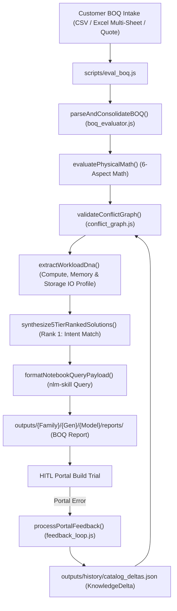

# Pre-Flight BOQ Evaluation & Closed-Loop Feedback Skill (`boq-eval-skill`)

---

## 1. Overview & Workflow Lifecycle (Workflow 2)

This skill provides an automated, agentic workflow representing **Workflow 2 (Pre-Flight Evaluation)** of the dual-workflow paradigm. It ingests raw customer BOQs, pre-cleans input data, runs deterministic 6-aspect physical math assertions, executes 5-level dependency conflict graph validation, profiles Workload DNA, dynamically routes to Gemini Notebook RAG via `notebooks.json`, and outputs the results to the dashboard and a dynamically generated **Corrected BOQ Excel workbook**.



---

## 2. Phase-by-Phase Execution Engine

### Phase 1: Ingestion & Multi-Sheet Multiplier Engine
- **Module**: [`scripts/lib/boq_evaluator.js`](file:///Users/macbookaira1466/Downloads/booktoSkill/scripts/lib/boq_evaluator.js)
- **Functions**: `parseAndConsolidateBOQ(rawContent, filePath)`
- **Capabilities**:
  - Multi-sheet Excel workbook inspection using `xlsx`.
  - Multi-Config Parallel Evaluation (`npm run eval:multi`) using `scripts/eval_multi_boq.js` to dynamically spin up independent `child_process` evaluators for massive scale.
  - Line separator normalization (`/`, `|`, `;`, `+`, `--`, tab columns).
  - Multi-part inline SKU extraction via `isValidHpeSKU()` filtering.
  - Chassis multiplier math (`serverQty * chassisMultiplier = totalConsolidatedQty`).

### Phase 2: Modular 6-Aspect Physical Math Pre-Checks
- **Module**: [`scripts/lib/boq_evaluator.js`](file:///Users/macbookaira1466/Downloads/booktoSkill/scripts/lib/boq_evaluator.js)
- **Functions**: `evaluatePhysicalMath(consolidatedItems)`
- **6 Physical Aspects**:
  1. **Compute & Thermal**: CPU TDP vs Heatsinks ([`P74792-B21`](file:///Users/macbookaira1466/Downloads/booktoSkill/scripts/lib/boq_evaluator.js)), High-Perf Fan Kits ([`P48820-B21`](file:///Users/macbookaira1466/Downloads/booktoSkill/scripts/lib/boq_evaluator.js)).
  2. **Memory & Channel**: 32 DIMM max, 8 channels/socket population rules.
  3. **Storage & Tri-Mode**: EDSFF vs SFF/LFF drive cages, Box 1/2 cables ([`P76453-B21`](file:///Users/macbookaira1466/Downloads/booktoSkill/scripts/lib/boq_evaluator.js)), Smart Battery ([`P01366-B21`](file:///Users/macbookaira1466/Downloads/booktoSkill/scripts/lib/boq_evaluator.js)).
  4. **Networking & PCIe**: OCP 3.0 NIC slots, PCIe slot capacity vs Riser math.
  5. **Power & Ambient**: -48VDC Lug Kits ([`P36877-B21`](file:///Users/macbookaira1466/Downloads/booktoSkill/scripts/lib/boq_evaluator.js)), Titanium 96% PSUs, AC/DC cord filtering.
  6. **Support & Services**: Hardware SKUs vs mandatory Tech Care Support tiers.

### Phase 2.5: 5-Level Dependency Conflict Graph & Closed-Loop Delta Auto-Injection
- **Module**: [`scripts/lib/conflict_graph.js`](file:///Users/macbookaira1466/Downloads/booktoSkill/scripts/lib/conflict_graph.js) & [`scripts/lib/catalog_rules.js`](file:///Users/macbookaira1466/Downloads/booktoSkill/scripts/lib/catalog_rules.js)
- **Functions**: `validateConflictGraph()`, `loadLearnedKnowledgeDeltas()`, `extractWorkloadDna()`, `synthesize5TierRankedSolutions()`
- **Closed-Loop Delta Auto-Injection**: `loadLearnedKnowledgeDeltas()` scans `master_knowledge_registry.json` and `catalog_deltas.json` during evaluation, automatically merging learned portal rejection rules into pre-checks.
- **Dual Safety Net**: Loads `<prefix>_Catalog_Rules.json` first, falls back to `<prefix>_Catalog.json`.
- **5 Rule Levels**: `VENDOR`, `CHASSIS`, `CATEGORY`, `SUBCATEGORY`, `SKU` + `LEARNED_DELTA`.
- **Workload DNA Extraction**: Infers `VDI_AI_GRAPHICS`, `DATABASE_IN_MEMORY`, `STORAGE_HIGH_IOPS`, or `VIRTUALIZATION_DENSE` profile.
- **Top 5 Resolution Matrix**: **Rank 1 strictly matches customer workload intent** (neither over- nor under-provisioned).

### Phase 3: Gemini Notebook RAG Payload Generation (Decoupled Architecture)
- **Module**: [`scripts/eval_boq.js`](file:///Users/macbookaira1466/Downloads/booktoSkill/scripts/eval_boq.js)
- **Functions**: `formatNotebookQueryPayload(items, evalResults)`
- **Dynamic Routing**: Dynamically derives the target Notebook ID via `scripts/config/notebooks.json` to prevent cross-pollination of vendor constraints.
- **Asynchronous Execution**: `eval_boq.js` does **not** block or execute the query directly. It embeds the `notebookPayload` in the output JSON. The frontend (`App.jsx`) intercepts this and fires a non-blocking background request to `/api/notebook-query-async`.
- **RAG Second Opinion**: The `ResolutionMatrix` UI renders a "Pending Verification" badge, which smoothly updates with the real RAG certification once the background polling completes.

### Phase 4: Budget Optimization & Golden Rule Assurance
- **Module**: [`scripts/lib/budget_optimizer.js`](file:///Users/macbookaira1466/Downloads/booktoSkill/scripts/lib/budget_optimizer.js)
- Enforces the Golden Rule: Mandatory buildability fixes take precedence over budget caps.

### Phase 5 & 6: Dual Outputs, Telemetry & Closed-Loop Feedback Learning
- **Output 1 (Dashboard API & Telemetry)**: Submissions sent via `/api/eval-boq` display in React frontend and automatically log execution metrics to `pipeline_telemetry.json` via [`scripts/lib/telemetry.js`](file:///Users/macbookaira1466/Downloads/booktoSkill/scripts/lib/telemetry.js).
- **Output 2 (Corrected BOQ Excel)**: Generates a multi-sheet **Corrected BOQ Excel** output (`/api/export-boq`) containing NotebookLM Rationale Summary and finalized BOM.
- **Feedback Module**: [`scripts/lib/feedback_loop.js`](file:///Users/macbookaira1466/Downloads/booktoSkill/scripts/lib/feedback_loop.js)
- **Command**: `npm run eval:boq <boq_file> --simulate-portal-error "<error_text>"` or Dashboard modal.
- Logs permanent `KnowledgeDeltas` in `outputs/history/catalog_deltas.json` and updates `_Catalog_Rules.json`.

---

## 💻 CLI Commands & Usage Examples

```bash
# Run BOQ evaluation with default chassis report auto-derived
npm run eval:boq tests/fixtures/test_boq_dl380_gen12.csv

# Run BOQ evaluation with explicit chassis variant override
node scripts/eval_boq.js tests/fixtures/test_boq_dl380_gen12.csv --chassis-variant LFF

# Simulate partner portal rejection and log KnowledgeDelta
npm run eval:boq tests/fixtures/test_boq_dl380_gen12.csv --simulate-portal-error "ERR_STORAGE_CABLE: Controller MR416i-p requires Cable Kit P76453-B21"
```
