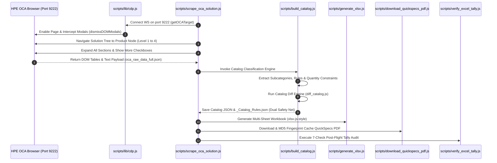

# OCA Catalog Scraper Skill (`oca-catalog-scraper`)

---

## 1. Purpose & Overview

Extract complete product catalog intelligence from the HPE OCA portal for any HPE product line (ProLiant, Synergy Composable, Alletra/Nimble/StoreOnce Storage, Aruba Networking, Cray Supercomputing). Produces a classified multi-sheet Excel workbook + companion JSON files stored under `outputs/{Family}/{Gen}/{Model}_{FormFactor}/`, suitable for Google Notebook LM, BOM comparison engines, and configuration intelligence.

---

## 2. Scraping Lifecycle Architecture (Mermaid Sequence Visual)



---

## 3. Current State & Certified Products (as of 2026-08-06)

| Product | Family | Output Prefix | SKUs | Audit | QuickSpecs PDF |
|---------|--------|---------------|------|-------|----------------|
| HPE ProLiant DL380 Gen12 SFF | ProLiant | `DL380_Gen12_SFF` | 951 | ✅ 100% | ✅ Verified (2.06 MB) |
| HPE Alletra Storage System | Alletra | `Alletra_Storage_System` | 92 | ✅ 100% | ✅ Verified (2.06 MB) |
| HPE ProLiant DL380 Gen11 | ProLiant | `DL380_Gen11` | 1,253 | ✅ 100% | ✅ Verified (2.06 MB) |
| HPE StoreEver MSL3040 Tape Library | StoreEver | `MSL3040_Tape` | 85 | ✅ 100% | ✅ Verified (2.06 MB) |
| HPE Cray Supercomputing GX5000 Rack | Cray | `GX5000_General_RACK` | 46 | ✅ 100% | ⚠️ Advisory |
| HPE Synergy VC 100Gb F32 Module | Synergy | `SY100Gb_F32_Module` | 141 | ✅ 100% | ✅ Verified (0.89 MB) |

**Total Portfolio Intelligence**: **2,568 unique SKUs** across 6 product lines in 5 families.

---

## 4. Key Production Components & Scripts

- **CDP Debugging Module**: [`scripts/lib/cdp.js`](file:///Users/macbookaira1466/Downloads/booktoSkill/scripts/lib/cdp.js) — WebSocket remote debugging connection over port 9222 with auto-retry and backoff.
- **Server/Compute Scraper**: [`scripts/scrape_oca_solution.js`](file:///Users/macbookaira1466/Downloads/booktoSkill/scripts/scrape_oca_solution.js) — Solution-first 4-level root traversal scraper (`npm run scrape`).
- **Storage Solution Wizard Scraper**: [`scripts/scrape_oca_storage_solution.js`](file:///Users/macbookaira1466/Downloads/booktoSkill/scripts/scrape_oca_storage_solution.js) — Wizard sub-tab scraper for Alletra/Nimble/StoreOnce (`npm run scrape:storage`).
- **Catalog Build Engine**: [`scripts/build_catalog.js`](file:///Users/macbookaira1466/Downloads/booktoSkill/scripts/build_catalog.js) — Compiles raw JSON into structured catalog JSON + TSVs + Dual Safety Net `*_Catalog_Rules.json`.
- **Excel Workbook Generator**: [`scripts/generate_xlsx.js`](file:///Users/macbookaira1466/Downloads/booktoSkill/scripts/generate_xlsx.js) — Multi-sheet Excel generator using `xlsx-js-style` with color-coded diff formatting.
- **QuickSpecs PDF Downloader**: [`scripts/download_quickspecs_pdf.js`](file:///Users/macbookaira1466/Downloads/booktoSkill/scripts/download_quickspecs_pdf.js) — Downloads PDF with MD5 fingerprint caching.
- **7-Check Tally Audit**: [`scripts/verify_excel_tally.js`](file:///Users/macbookaira1466/Downloads/booktoSkill/scripts/verify_excel_tally.js) — Post-flight audit engine.
- **Master Registry Auto-Synchronizer**: [`scripts/lib/sync_registry.js`](file:///Users/macbookaira1466/Downloads/booktoSkill/scripts/lib/sync_registry.js) — Updates `outputs/SCRAPED_CATALOGS.md` (`npm run registry:sync`).

---

## 5. Critical Distinction: QuickSpecs Link vs Menu Link

| Element | Selector | Action | Purpose |
|---------|----------|--------|---------|
| Chain link icon 🔗 | `a.qs-link-a`, `i.icon-chain2.qs-link-icon` | **DO NOT CLICK for navigation** | Downloads/opens QuickSpecs PDF |
| Menu tab label | `.menu_label`, `a[href*="extended_overview_menu"]` | **CLICK FOR CATALOG SCRAPING** | Opens component Menu tab in OCA |

---

## 6. Execution Commands

```bash
# E2E Server/Solution Scrape (DL380 Gen12 / Synergy / Cray)
npm run scrape

# E2E Storage Solution Wizard Scrape (Alletra / Nimble / StoreOnce)
npm run scrape:storage

# Rebuild all scraped catalogs & regenerate workbooks
npm run rebuild

# Sync portfolio registry
npm run registry:sync
```
