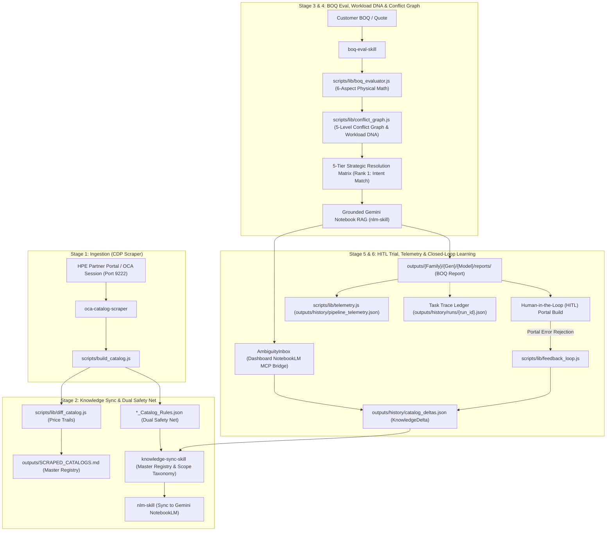

# Orchestrator Workflow Skill — End-to-End Autonomous Lifecycle (`orchestrator-workflow-skill`)

This skill defines the macro-architecture that ties all individual agentic skills into a single **Continuous Learning Loop**. Whenever you are managing a complex task in this workspace, refer to this 6-stage lifecycle to understand your exact role, execution boundaries, and sub-skill delegation pathways.

---

## 🏛️ Macro Architecture & Continuous Learning Loop (Mermaid Visual)

---

## 🔁 The 6-Stage Continuous Learning Lifecycle

### 1. Ingestion (Live Scraping)
- **Actor**: [`oca-catalog-scraper`](file:///Users/macbookaira1466/Downloads/booktoSkill/.agents/skills/oca-catalog-scraper/SKILL.md)
- **Action**: Scrapes the live HPE OCA vendor portal via Chrome DevTools Protocol (`scripts/lib/cdp.js`) over port 9222.
- **Output**: Generates classified JSON catalogs, standalone rules files (`*_Catalog_Rules.json`), and multi-sheet Excel workbooks (`*_OCA_Catalog.xlsx`).

### 2. Decoupled Knowledge Sync & Dual Safety Net
- **Actor**: [`diff_catalog.js`](file:///Users/macbookaira1466/Downloads/booktoSkill/scripts/lib/diff_catalog.js) & [`knowledge-sync-skill`](file:///Users/macbookaira1466/Downloads/booktoSkill/.agents/skills/knowledge-sync-skill/SKILL.md)
- **Action**: 
  - Compares newly scraped JSON against historical snapshots to log SKU additions, removals, and cumulative price trails.
  - Emits standalone `*_Catalog_Rules.json` for fast dual safety net loading.
  - Auto-synchronizes `outputs/SCRAPED_CATALOGS.md` master registry (`npm run registry:sync`).
  - **Decoupled Workflow**: Knowledge Sync (pushing to NotebookLM via CLI or MCP) now runs as an independent background task (`/api/sync-knowledge`) to ensure core scraping speed is unaffected.

### 3. BOQ Ingestion, 8-Stage Atomicity & Conflict Graph
- **Actor**: [`boq-eval-skill`](file:///Users/macbookaira1466/Downloads/booktoSkill/.agents/skills/boq-eval-skill/SKILL.md) (`npm run eval:boq <file>`)
- **Action**:
  - **8-Stage Atomic Execution**: Streams `STRUCTURED_PROGRESS` JSON events so dashboards provide visual timeline feedback.
  - Ingests customer BOQs, multi-sheet proposals, or obfuscated SKU text.
  - Extracts **Workload DNA Profile** (CPU core/freq density, RAM per core ratio, GPU VDI class, NVMe RI vs MU vs WI SSDs).
  - Evaluates deterministic 6-aspect physical math assertions (Compute, Memory, Storage, Networking, Power, Support).
  - Validates full BOM + fixes across 5 rule hierarchy levels (`VENDOR`, `CHASSIS`, `CATEGORY`, `SUBCATEGORY`, `SKU`) using `conflict_graph.js`.
  - Outputs a **5-Tier Strategic Resolution Matrix** where **Rank 1 strictly matches customer workload intent** (neither over- nor under-provisioned).
  - Exposes **Confidence Breakdown Tooltips** to drill down into specific physical mismatch penalties.

### 4. Grounded Gemini Notebook Validation (RAG) & Dashboard Command Center
- **Actor**: [`nlm-skill`](file:///Users/macbookaira1466/Downloads/booktoSkill/.agents/skills/nlm-skill/SKILL.md) & **React Dashboard** (`http://localhost:5173`)
- **Action**: 
  - Initiates parallel, non-blocking asynchronous queries to Gemini NotebookLM to cross-reference identified physical constraints against vendor spec sheets.
  - The React Dashboard provides a full Command-and-Control hub for triggering Knowledge Sync, exporting corrected BOQs, logging portal rejection KnowledgeDeltas, and managing the async RAG status polling (`GET /api/notebook-query-status/:jobId`).

### 5. Human-in-the-Loop (HITL) Portal Trial & Ambiguity Resolution
- **Actor**: Human Sales Engineer / User & Dashboard `AmbiguityInbox`
- **Action**: 
  - Takes the top-ranked solution from the Dashboard and attempts to build it in the live OCA portal.
  - If a BOQ evaluation drops below 75% confidence, the **Ambiguity Inbox** prompts the user to Auto-Query NotebookLM via the MCP bridge to acquire missing configuration rules.

### 6. Closed-Loop Feedback & Telemetry Learning
- **Actor**: [`feedback_loop.js`](file:///Users/macbookaira1466/Downloads/booktoSkill/scripts/lib/feedback_loop.js), `server.cjs` Trace Ledger, & Dashboard Modal
- **Action**:
  - Log vendor rejections via `npm run eval:boq <boq> --simulate-portal-error "<error>"` or directly via the Dashboard **"Report Portal Rejection"** modal.
  - Permanently appends `KnowledgeDeltas` to `history/catalog_deltas.json` and updates `_Catalog_Rules.json`.
  - Records execution metrics in `pipeline_telemetry.json` and persistent trace replays in `runs/{run_id}.json` (`npm run trace:view <id>`).

---

## 🎯 Sub-Skill Routing & Execution Directory

| Task / Intent | Active Sub-Skill | Command Target |
|---|---|---|
| Trigger autonomous scrape sequence | [`oca-catalog-scraper`](file:///Users/macbookaira1466/Downloads/booktoSkill/.agents/skills/oca-catalog-scraper/SKILL.md) | `npm run scrape:auto` / `npm run probe:cdp` |
| Parallel eval of multi-sheet BOQs | [`boq-eval-skill`](file:///Users/macbookaira1466/Downloads/booktoSkill/.agents/skills/boq-eval-skill/SKILL.md) | `npm run eval:multi <boq_file>` |
| Ingest & evaluate single BOQ config | [`boq-eval-skill`](file:///Users/macbookaira1466/Downloads/booktoSkill/.agents/skills/boq-eval-skill/SKILL.md) | `npm run eval:boq <boq_file>` |
| Query Gemini NotebookLM RAG | [`nlm-skill`](file:///Users/macbookaira1466/Downloads/booktoSkill/.agents/skills/nlm-skill/SKILL.md) | `nlm notebook query <id> "<prompt>"` |
| Replay historical pipeline logs | Dashboard / Trace Engine | `npm run trace:view <runId>` |
| Portfolio health & telemetry audit | Dashboard | `npm run status` |

---

## 🧠 NotebookLM MCP Integration & Token Preservation Guidelines

When AI Agents (like Antigravity IDE) or the Node.js Dashboard interact with Gemini NotebookLM, they MUST adhere to the following architecture rules to prevent token burn and timeouts:

### 1. Dual-Routing (CLI vs. MCP Server)
- **The Node.js Dashboard / Pipeline Scripts**: Uses the stateless `nlm` CLI binary invoked asynchronously via `child_process` (handled gracefully by the `/api/notebook-query-async` Express route). This prevents UI blocking and protects against zombie processes via strict iteration limits.
- **The AI Agents (Antigravity IDE / Gemini Spark)**: Interact directly with the long-lived **MCP Server** (`mcp__gemini-notebook-mcp__*` tools). The same local MCP installation handles both routes transparently.

### 2. Asynchronous "Fire-and-Forget" Pattern for Studio Artifacts
When generating heavy media (Podcasts/Audio, Infographics, Videos, Reports) via NotebookLM, **NEVER** use synchronous blocking execution.
1. **Creation**: Dispatch the task using `studio_create(artifact_type="...", confirm=True)` which returns an `artifact_id` instantly.
2. **Polling**: Execute intermediate tasks (like logging telemetry), then asynchronously poll `studio_status(notebook_id, artifact_id)`.
3. **Download**: Only trigger `download_artifact` once status transitions to `completed`.
This asynchronous pattern is mandated for all agents to protect context window limits.

---

## 🔄 The Human-Triggered Closed-Loop Execution Lifecycle

To prevent any ambiguity for future agents observing this system, here is the exact chronological flow of how a human trigger evolves into autonomous system improvement:

1. **The Human Trigger (Step 1)**: The Sales Engineer drops an Excel quote into the Dashboard UI. 
2. **The Autonomous Pipeline (Step 2)**: The system takes over seamlessly. It streams 8 stages of execution via SSE, extracts Workload DNA, runs physical math (thermal/power limits), and ranks solutions.
3. **The Results UI (Step 3)**: The human views the `ConflictGraphInspector` and the `ResolutionMatrix` on the dashboard. They see exactly *why* a math rule failed (Explainability) and what the NotebookLM AI suggests as a fix (RAG).
4. **The Live Trial (Step 4)**: The human takes the Rank 1 suggestion and manually builds it inside the live HPE OCA Partner Portal UI.
5. **The Feedback Bifurcation (Step 5)**:
   - *If it works*: The human does nothing. The pipeline run telemetry logs a "Success" trace in `pipeline_telemetry.json`.
   - *If the Portal rejects it (Ambiguity/Missing Rule)*: The human clicks **"Report Portal Error"** on the Dashboard and pastes the exact HPE error string (e.g., "Feature XYZ requires License ABC").
6. **The Closed-Loop Learning (Step 6)**:
   - `feedback_loop.js` parses the error and writes a new persistent rule to `history/catalog_deltas.json`.
   - On the next run, `conflict_graph.js` dynamically injects this learned delta into the pre-flight checks.
   - **The Result**: Because the system has learned the missing rule, the system will never suggest that invalid configuration again. The Confidence Score for future identical BOQs instantly improves (e.g., jumping from 60% to 100%), completely resolving the ambiguity without touching core code!

### Who is the Workflow Orchestrator?
To be absolutely clear, the "Orchestrator" in this architecture is context-dependent:
- **For Human Dashboard Triggers**: The **Node.js Express Server (`server.cjs`)** is the workflow orchestrator. It listens for the HTTP trigger, spawns the evaluation scripts in isolated shells, collects the telemetry, pipes the SSE stream to the UI, and formats the final ledger.
- **For Autonomous AI Triggers**: **You (The AI Agent reading this document)** are the workflow orchestrator. Guided by this `orchestrator-workflow-skill`, you are responsible for running the `npm` commands, parsing the console output, passing context to the NotebookLM MCP, and feeding the final decisions back to the user.
