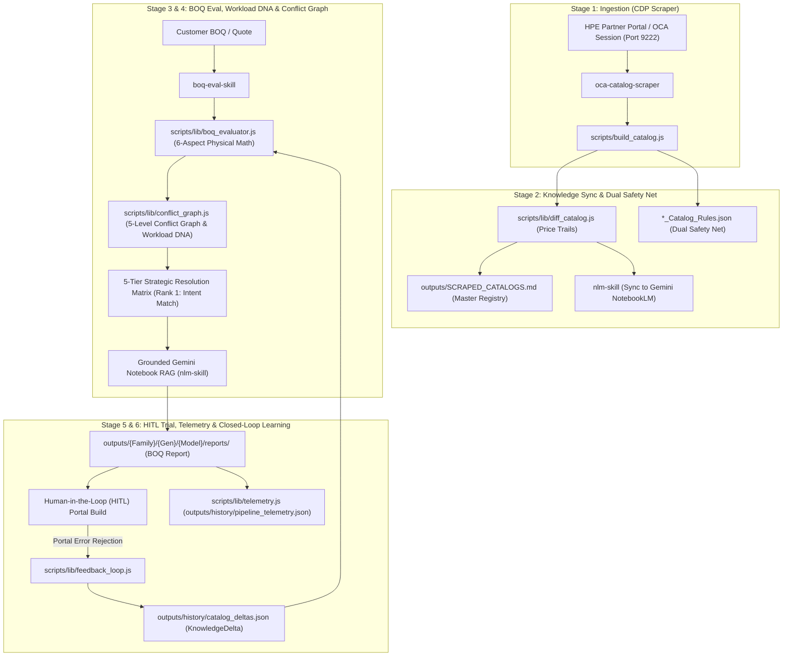

# Orchestrator Workflow Skill — End-to-End Autonomous Lifecycle (`orchestrator-workflow-skill`)

This skill defines the macro-architecture that ties all individual agentic skills into a single **Continuous Learning Loop**. Whenever you are managing a complex task in this workspace, refer to this 6-stage lifecycle to understand your exact role, execution boundaries, and sub-skill delegation pathways.

---

## 🏛️ Macro Architecture & Continuous Learning Loop (Mermaid Visual)

---

## 🔁 The 6-Stage Continuous Learning Lifecycle

### 1. Ingestion (Live Scraping)
- **Actor**: [`oca-catalog-scraper`](file:///Users/macbookaira1466/Downloads/booktoSkill/.agents/skills/oca-catalog-scraper/SKILL.md)
- **Action**: Scrapes the live HPE OCA vendor portal via Chrome DevTools Protocol (`scripts/lib/cdp.js`) over port 9222.
- **Output**: Generates classified JSON catalogs, standalone rules files (`*_Catalog_Rules.json`), and multi-sheet Excel workbooks (`*_OCA_Catalog.xlsx`).

### 2. Knowledge Sync & Dual Safety Net
- **Actor**: [`diff_catalog.js`](file:///Users/macbookaira1466/Downloads/booktoSkill/scripts/lib/diff_catalog.js) & [`nlm-skill`](file:///Users/macbookaira1466/Downloads/booktoSkill/.agents/skills/nlm-skill/SKILL.md)
- **Action**: 
  - Compares newly scraped JSON against historical snapshots to log SKU additions, removals, and cumulative price trails.
  - Emits standalone `*_Catalog_Rules.json` for fast dual safety net loading.
  - Auto-synchronizes `outputs/SCRAPED_CATALOGS.md` master registry (`npm run registry:sync`).

### 3. BOQ Ingestion, Workload DNA & 5-Level Conflict Graph
- **Actor**: [`boq-eval-skill`](file:///Users/macbookaira1466/Downloads/booktoSkill/.agents/skills/boq-eval-skill/SKILL.md) (`npm run eval:boq <file>`)
- **Action**:
  - Ingests customer BOQs, multi-sheet proposals, or obfuscated SKU text.
  - Extracts **Workload DNA Profile** (CPU core/freq density, RAM per core ratio, GPU VDI class, NVMe RI vs MU vs WI SSDs).
  - Evaluates deterministic 6-aspect physical math assertions (Compute, Memory, Storage, Networking, Power, Support).
  - Validates full BOM + fixes across 5 rule hierarchy levels (`VENDOR`, `CHASSIS`, `CATEGORY`, `SUBCATEGORY`, `SKU`) using `conflict_graph.js`.
  - Outputs a **5-Tier Strategic Resolution Matrix** where **Rank 1 strictly matches customer workload intent** (neither over- nor under-provisioned).

### 4. Grounded Gemini Notebook Validation (RAG)
- **Actor**: [`nlm-skill`](file:///Users/macbookaira1466/Downloads/booktoSkill/.agents/skills/nlm-skill/SKILL.md)
- **Action**: Programmatically queries Gemini NotebookLM (`Dl 380 Spec Gen 12` - ID: `1d190853-4e9c-48df-aa70-eae66c6f2c1f`) to cross-reference identified constraints against synced spec sheet documentation.

### 5. Human-in-the-Loop (HITL) Portal Trial
- **Actor**: Human Sales Engineer / User
- **Action**: Takes the top-ranked solution from Section 2.6 of the generated report (`outputs/{Family}/{Gen}/{Model}_{FormFactor}/reports/BOQ_Evaluation_{name}.md`) and verifies or builds it in the live vendor OCA portal.

### 6. Closed-Loop Feedback & Telemetry Learning
- **Actor**: [`feedback_loop.js`](file:///Users/macbookaira1466/Downloads/booktoSkill/scripts/lib/feedback_loop.js) & [`telemetry.js`](file:///Users/macbookaira1466/Downloads/booktoSkill/scripts/lib/telemetry.js)
- **Action**:
  - Log vendor rejections via `npm run eval:boq <boq> --simulate-portal-error "<error>"`.
  - Permanently appends `KnowledgeDeltas` to `history/catalog_deltas.json` and updates `_Catalog_Rules.json`.
  - Records execution metrics in `outputs/history/pipeline_telemetry.json` for observability (`npm run status`).

---

## 🎯 Sub-Skill Routing & Execution Directory

| Task / Intent | Active Sub-Skill | Command Target |
|---|---|---|
| Live scrape chassis/storage solution | [`oca-catalog-scraper`](file:///Users/macbookaira1466/Downloads/booktoSkill/.agents/skills/oca-catalog-scraper/SKILL.md) | `npm run scrape` / `npm run scrape:storage` |
| Ingest & evaluate customer BOQ / BOM | [`boq-eval-skill`](file:///Users/macbookaira1466/Downloads/booktoSkill/.agents/skills/boq-eval-skill/SKILL.md) | `npm run eval:boq <boq_file>` |
| Query Gemini NotebookLM RAG | [`nlm-skill`](file:///Users/macbookaira1466/Downloads/booktoSkill/.agents/skills/nlm-skill/SKILL.md) | `nlm notebook query <id> "<prompt>"` |
| Portfolio health & telemetry audit | Dashboard | `npm run status` |
