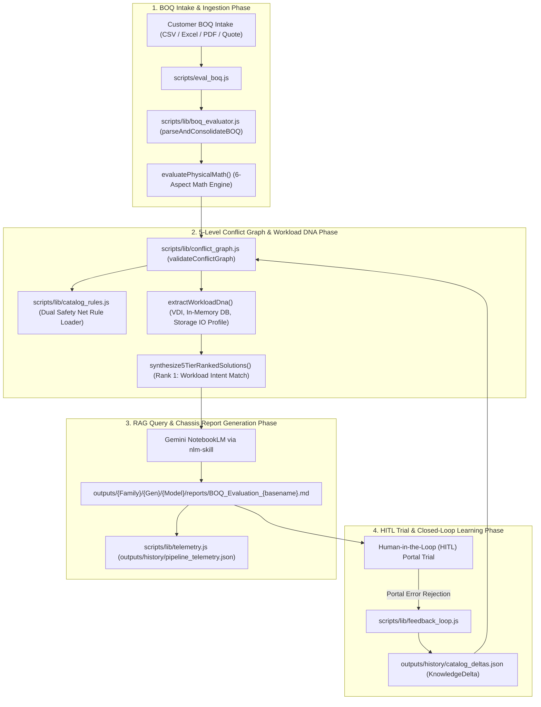

# Master Architecture: End-to-End Skill Orchestration, Conflict Graph & Closed-Loop Feedback Engine

---

## 1. Executive Summary & Orchestration Blueprint

This document defines the complete end-to-end operational architecture connecting our core agentic skills:
1. **`boq-eval-skill`**: Pre-flight BOQ ingestion (multi-sheet Excel, multiplier logic, line separators), modular 6-aspect physical math evaluation, 5-level dependency conflict graph validation, Workload DNA profiling, confidence scoring, and HITL triggers.
2. **`nlm-skill`**: Gemini Notebook RAG query layer supporting natural language spec sheet searches, 5-tier resolution matrices, and technical attribute filters (`Memory > 32GB`, `CPU Cores >= 32`, `NVMe U.3`).
3. **`oca-catalog-scraper`**: 100% hands-free CDP browser scraper and partner portal configuration validator.

---

## 2. Phase-by-Phase Skill Execution Details

### Phase 1: BOQ Ingestion & Multi-Aspect Pre-Check ([`boq-eval-skill`](file:///Users/macbookaira1466/Downloads/booktoSkill/.agents/skills/boq-eval-skill/SKILL.md))
- Ingests customer BOQ text or multi-sheet Excel workbooks.
- Normalizes separators (`/`, `|`, `;`, `+`, `--`).
- Filters HPE hardware/service SKUs using `isValidHpeSKU()`.
- Runs deterministic 6-aspect physical math assertions (Compute, Memory, Storage, Networking, Power, Support).

### Phase 2: 5-Level Conflict Graph & Workload DNA Profiling ([`conflict_graph.js`](file:///Users/macbookaira1466/Downloads/booktoSkill/scripts/lib/conflict_graph.js))
- Loads catalog rules using Dual Safety Net (`*_Catalog_Rules.json` -> `*_Catalog.json`).
- Validates BOM + injected fixes across 5 hierarchy levels (`VENDOR`, `CHASSIS`, `CATEGORY`, `SUBCATEGORY`, `SKU`).
- Infers customer **Workload DNA Profile** (CPU core/freq density, RAM per core ratio, GPU VDI class, NVMe RI vs MU vs WI specs).
- Synthesizes 5 ranked solution tiers where **Rank 1 strictly matches customer workload intent** (neither over- nor under-provisioned).

### Phase 3: Grounded Gemini RAG Validation ([`nlm-skill`](file:///Users/macbookaira1466/Downloads/booktoSkill/.agents/skills/nlm-skill/SKILL.md))
- Queries Gemini NotebookLM (`Dl 380 Spec Gen 12` - ID: `1d190853-4e9c-48df-aa70-eae66c6f2c1f`) for grounded technical attribute verification.

### Phase 4: Chassis-Scoped Report Output & Telemetry
- Saves evaluation report to `outputs/{Family}/{Gen}/{Model}_{FormFactor}/reports/BOQ_Evaluation_{basename}.md`.
- Records run metrics in `outputs/history/pipeline_telemetry.json` for pipeline observability (`npm run status`).

### Phase 5 & 6: HITL Trial & Closed-Loop Feedback Learning ([`feedback_loop.js`](file:///Users/macbookaira1466/Downloads/booktoSkill/scripts/lib/feedback_loop.js))
- Simulates or captures vendor portal rejections (`npm run eval:boq <boq> --simulate-portal-error "<error>"`).
- Appends `KnowledgeDeltas` to `history/catalog_deltas.json` and updates `_Catalog_Rules.json`.
