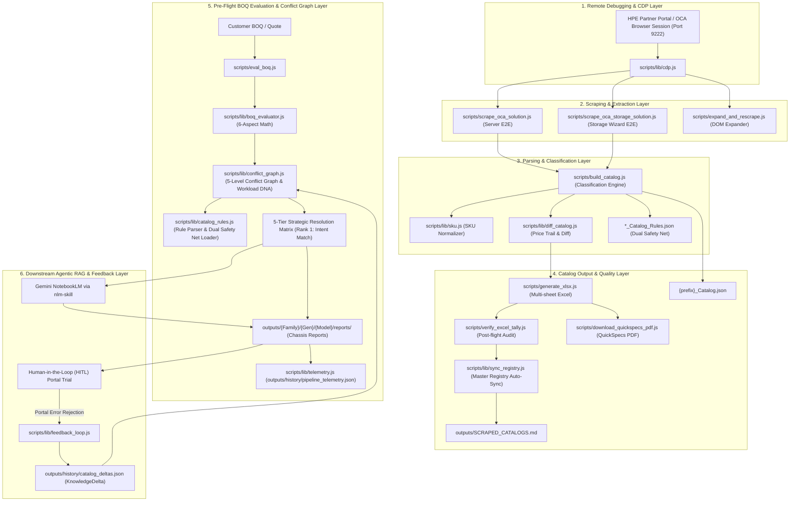

# HPE OCA Intelligence Pipeline — Project Architecture & Documentation Index

This document provides a comprehensive overview of the project architecture, repository layout, data flow, and detailed explanations of all key Markdown (`.md`) documentation files used by developers, scrapers, and AI agents in this workspace.

---

## 🏛️ System Architecture & End-to-End Data Flow

---

## 📖 Key Markdown Files & Their Roles

| File Path | Component / Layer | Primary Purpose | Key Audience / Consumers |
|---|---|---|---|
| [.agents/AGENTS.md](file:///Users/macbookaira1466/Downloads/booktoSkill/.agents/AGENTS.md) | Workspace Rules & Governance | Defines strict project guidelines, zero-hardcoding rules, CDP port rules, directory structures, audit quality thresholds, diff tracking, and Workload DNA Rule #39. | Antigravity AI Agent & Developers |
| [.agents/skills/orchestrator-workflow-skill/SKILL.md](file:///Users/macbookaira1466/Downloads/booktoSkill/.agents/skills/orchestrator-workflow-skill/SKILL.md) | Master Orchestration Skill | 6-stage continuous learning lifecycle, Mermaid architecture diagram, and sub-skill routing links. | Antigravity AI Agent |
| [.agents/skills/boq-eval-skill/SKILL.md](file:///Users/macbookaira1466/Downloads/booktoSkill/.agents/skills/boq-eval-skill/SKILL.md) | Pre-Flight BOQ Evaluation Skill | Ingests BOQs, 6-aspect physical math, 5-level conflict graph, Workload DNA profiling, 5-Tier resolution matrix, and closed-loop feedback delta logging. | Antigravity AI Agent & Engineers |
| [.agents/skills/oca-catalog-scraper/SKILL.md](file:///Users/macbookaira1466/Downloads/booktoSkill/.agents/skills/oca-catalog-scraper/SKILL.md) | OCA Scraping Skill | CDP remote debugging on port 9222, solution tree traversal, section expansion, catalog compilation, Excel workbook generation, and PDF caching. | Antigravity AI Agent |
| [.agents/skills/nlm-skill/SKILL.md](file:///Users/macbookaira1466/Downloads/booktoSkill/.agents/skills/nlm-skill/SKILL.md) | Gemini Notebook MCP Skill | Expert guide for `nlm` CLI and 43 MCP tools for RAG queries, spec sheet searches, studio content creation, and token optimization. | Antigravity AI Agent |
| [docs/HPE_CATALOG_RULES_AND_CONSISTENCY_CHARTER.md](file:///Users/macbookaira1466/Downloads/booktoSkill/docs/HPE_CATALOG_RULES_AND_CONSISTENCY_CHARTER.md) | HPE Rules & Consistency Charter | Configuration rules, 5-Tier Strategic Resolution Hierarchy, physical math, chassis base prices ($5,584.00), support pricing, and system prompt templates. | AI Agent & Auditors |
| [docs/ORCHESTRATED_PIPELINE_AND_FEEDBACK_LOOP.md](file:///Users/macbookaira1466/Downloads/booktoSkill/docs/ORCHESTRATED_PIPELINE_AND_FEEDBACK_LOOP.md) | Master Orchestration Architecture | Workflow lifecycle, 5-level conflict graph, Workload DNA profiling, and telemetry logging architecture. | Developers & Architects |
| [outputs/SCRAPED_CATALOGS.md](file:///Users/macbookaira1466/Downloads/booktoSkill/outputs/SCRAPED_CATALOGS.md) | Portfolio Master Registry | Inventory table listing every scraped chassis catalog (2,568+ SKUs across ProLiant, Alletra, Synergy, StoreEver, Cray), total SKUs, total rules, artifact links, and audit pass statuses. | Humans, Agents & CI Audit |
| [README.md](file:///Users/macbookaira1466/Downloads/booktoSkill/README.md) | Project Overview & Quickstart | Quickstart instructions, CDP browser setup across macOS/Linux/Windows, npm execution targets, output standards, and test suite commands. | Developers & System Admin |

---

## 🔍 Modules Reference Table

| Module File | Purpose | Key Functionality |
|---|---|---|
| [`scripts/lib/conflict_graph.js`](file:///Users/macbookaira1466/Downloads/booktoSkill/scripts/lib/conflict_graph.js) | Dependency Conflict Graph & Workload DNA | 5-level rule validation (`VENDOR`, `CHASSIS`, `CATEGORY`, `SUBCATEGORY`, `SKU`), Workload DNA profiling, 5-Tier resolution matrix synthesis. |
| [`scripts/lib/catalog_rules.js`](file:///Users/macbookaira1466/Downloads/booktoSkill/scripts/lib/catalog_rules.js) | Multi-Level Rule Parser | Classifies raw rules into 5 levels; Dual Safety Net loader (`*_Catalog_Rules.json` -> `*_Catalog.json`). |
| [`scripts/lib/telemetry.js`](file:///Users/macbookaira1466/Downloads/booktoSkill/scripts/lib/telemetry.js) | Telemetry Recorder | Captures evaluation & feedback metrics in `outputs/history/pipeline_telemetry.json`. |
| [`scripts/eval_boq.js`](file:///Users/macbookaira1466/Downloads/booktoSkill/scripts/eval_boq.js) | Primary BOQ Evaluator | CLI tool generating chassis-scoped markdown reports (`outputs/{Family}/{Gen}/{Model}/reports/`). |
| [`scripts/observability_status.js`](file:///Users/macbookaira1466/Downloads/booktoSkill/scripts/observability_status.js) | Observability Dashboard | Renders complete status overview (`npm run status`). |
