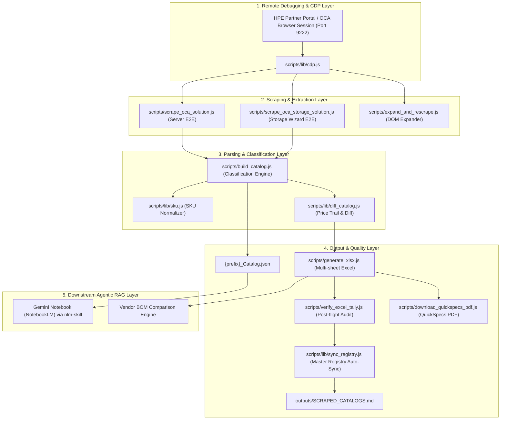

# HPE OCA Intelligence Pipeline — Project Architecture & Markdown Documentation Index

This document provides a comprehensive overview of the project architecture, repository layout, data flow, and detailed explanations of all key Markdown (`.md`) documentation files used by developers, scrapers, and AI agents in this workspace.

---

## 🏛️ Project Architecture & Data Flow

---

## 📖 Key Markdown Files & Their Roles

| File Path | Component / Layer | Primary Purpose | Key Audience / Consumers |
|---|---|---|---|
| [.agents/AGENTS.md](file:///Users/macbookaira1466/Downloads/booktoSkill/.agents/AGENTS.md) | Workspace Rules & Governance | Defines strict project guidelines, zero-hardcoding rules, CDP port rules, directory structures, audit quality thresholds, and diff tracking mandates. | Antigravity AI Agent & Developers |
| [.agents/skills/oca-catalog-scraper/SKILL.md](file:///Users/macbookaira1466/Downloads/booktoSkill/.agents/skills/oca-catalog-scraper/SKILL.md) | OCA Scraping Skill | Step-by-step procedure for connecting to CDP port 9222, traversing solution trees, expanding sections, building catalogs, generating Excel workbooks, and downloading PDFs. | Antigravity AI Agent |
| [.agents/skills/nlm-skill/SKILL.md](file:///Users/macbookaira1466/Downloads/booktoSkill/.agents/skills/nlm-skill/SKILL.md) | Gemini Notebook MCP Skill | Comprehensive expert guide for `nlm` CLI and 43 MCP tools. Enables RAG queries, spec sheet searches, studio content creation (audio, report, mindmap, slides, infographics, data tables), and token optimization. | Antigravity AI Agent |
| [outputs/SCRAPED_CATALOGS.md](file:///Users/macbookaira1466/Downloads/booktoSkill/outputs/SCRAPED_CATALOGS.md) | Portfolio Master Registry | Canonical inventory table listing every scraped chassis catalog (2,568+ SKUs across ProLiant, Alletra, Synergy, StoreEver, Cray), total SKUs, total rules, artifact links, and audit pass statuses. | Humans, Agents & CI Audit |
| [README.md](file:///Users/macbookaira1466/Downloads/booktoSkill/README.md) | Project Overview & Quickstart | General documentation, CDP browser launch commands across macOS/Linux/Windows, npm execution targets, output standards, and SKU schema definitions. | Human Developers & System Admin |
| [docs/GEMINI_NOTEBOOK_SETUP_GUIDE.md](file:///Users/macbookaira1466/Downloads/booktoSkill/docs/GEMINI_NOTEBOOK_SETUP_GUIDE.md) | MCP Setup Guide | Deep integration instructions for setting up `notebooklm-mcp-cli` v0.9.6 on macOS, Linux Mint, and Windows 10/11. | Developers & AI Agents |

---

## 🔍 Detailed Breakdown of Key Files

### 1. `.agents/AGENTS.md` (Project Rules & Rules Engine)
This is the **primary instruction charter** for all Antigravity agent interactions in this repository. It contains:
- **Pipeline State of Health Table**: Tracks 100% audit certified products (DL380 Gen12 SFF, Alletra Storage System, DL380 Gen11, StoreEver MSL3040, Cray GX5000, Synergy VC 100Gb F32 Module).
- **29 Binding Rules**:
  - *Rule 1-3 (Authentication & CDP)*: Never navigate directly to OCA URLs; use Chrome DevTools Protocol on port 9222 via `scripts/lib/cdp.js`.
  - *Rule 4-7 (Scraping)*: Expand DOM sections (`scrollHeight >= 15,000px`), chunk large extractions, skip nav menu items (< 1,010 threshold).
  - *Rule 8-11 (Data Quality)*: Capture subcategory quantity constraints (`(max N)`, `(required)`, `(no max)`), numeric `Current Qty` regex (`/^\d+$/`), start/discontinued availability dates.
  - *Rule 12 (Zero Hardcoding)*: All paths, chassis shorthand, file prefixes must be derived dynamically from CLI arguments.
  - *Rule 13-15 (Outputs)*: Multi-sheet Excel workbook structure (`Category Summary`, `All SKUs`, `Rules & Constraints`, `Catalog Diff & History`, category sheets, `Metadata`), JSON companion, output folder naming `outputs/{Family}/{Gen}/{Model}_{FormFactor}/`.
  - *Rule 17 (Solution-First 4-Level Traversal Protocol)*: `Solution > Icon > Product Node > Category > Subcategory`.
  - *Rule 28 (Historical Catalog Diff & Price Tracking)*: Tracks SKU additions (`ADDED`), tombstones (`REMOVED`), price adjustments (`PRICE_CHANGED`), and logs cumulative price trails in `price_history.json`.

---

### 2. `.agents/skills/oca-catalog-scraper/SKILL.md`
The dedicated skill for extracting and building hardware catalogs from HPE OCA.
- **Key Workflow**:
  1. Detect active `oca.ext.hpe.com` CDP target via `scripts/lib/cdp.js`.
  2. Execute integrated scraper (`npm run scrape` or `npm run scrape:storage`).
  3. Generate TSVs, multi-sheet Excel with cell-level styling (`xlsx-js-style`), and JSON companion.
  4. Download & MD5-cache QuickSpecs PDF (> 500 KB).
  5. Run 7-point post-flight audit script (`scripts/verify_excel_tally.js`).

---

### 3. `.agents/skills/nlm-skill/SKILL.md`
The expert agentic skill for Gemini Notebook (NotebookLM).
- **Core Capabilities**:
  - **Tool Detection**: Checks whether MCP tools or `nlm` CLI are available.
  - **RAG Querying**: Runs grounded Q&A against spec sheet notebooks without polluting Antigravity context tokens.
  - **Studio Generation**: Produces audio podcasts, reports, quizzes, flashcards, mind maps, slide decks, infographics, and data tables.
  - **Multi-Profile Management**: Supports multiple Google accounts via `nlm login switch <profile>`.

---

### 4. `outputs/SCRAPED_CATALOGS.md`
The live catalog registry automatically maintained by `scripts/lib/sync_registry.js`.
- Automatically updated every time a chassis is scraped or rebuilt (`npm run registry:sync`).
- Acts as the single source of truth for portfolio intelligence (2,568 SKUs across 6 product lines).

---

### 5. `docs/GEMINI_NOTEBOOK_SETUP_GUIDE.md`
Step-by-step setup documentation for `notebooklm-mcp-cli` v0.9.6 across macOS Monterey (x86_64 MacBook Air), Linux Mint / Ubuntu, and Windows 10/11 PowerShell.
